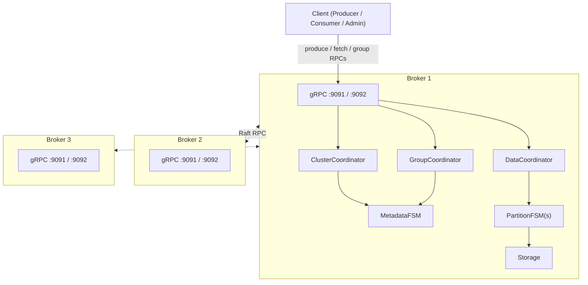

# BunnyMQ

BunnyMQ is a Kafka-compatible distributed message broker written in Go. It uses [dragonboat](https://github.com/lni/dragonboat) (Multi-Raft) for replication, gRPC + Protobuf for its wire protocol, and a segmented append-only log for storage. The system targets three-or-more-node clusters and provides topics, partitions, consumer groups, and configurable delivery guarantees (`acks=0` and `acks=all`).

---

## Architecture



Group RPCs (JoinGroup, Heartbeat, LeaveGroup, CommitOffset) are served by the metadata-shard leader. Produce and fetch RPCs are served by the partition-shard leader, with automatic leader redirect on mismatch. Detailed sequence diagrams are in [`docs/design/sequence/`](docs/design/sequence/).

---

## Prerequisites

| Tool | Version | Purpose |
|------|---------|---------|
| Go | 1.23+ | Build and test |
| Docker + docker-compose | any recent | Cluster mode and docker integration tests |
| protoc + protoc-gen-go | latest | Proto code generation (only if editing `.proto` files) |

---

## Quick start — docker-compose

```bash
make cluster-up     # build image and start 3-node cluster
make cluster-logs   # follow logs from all brokers
make cluster-down   # stop cluster and remove data volumes
```

The three brokers expose their management and data gRPC ports on the host:

| Broker | Management | Data | Metrics |
|--------|-----------|------|---------|
| broker1 | `localhost:19091` | `localhost:19092` | `localhost:19090` |
| broker2 | `localhost:29091` | `localhost:29092` | `localhost:29090` |
| broker3 | `localhost:39091` | `localhost:39092` | `localhost:39090` |

---

## Quick start — native (3 processes)

```bash
make build   # produces ./bunnymq binary via go build ./...
```

The broker reads configuration from a YAML file (first argument) or from environment variables. Start three terminals:

```bash
# Terminal 1 — node 1
NODE_ID=1 RAFT_ADDR=localhost:7001 MGMT_ADDR=:9091 DATA_ADDR=:9092 \
  METRICS_ADDR=:9090 DATA_DIR=/tmp/bunnymq/node1 \
  INITIAL_MEMBERS="1=localhost:7001,2=localhost:7002,3=localhost:7003" \
  ./bunnymq

# Terminal 2 — node 2
NODE_ID=2 RAFT_ADDR=localhost:7002 MGMT_ADDR=:9093 DATA_ADDR=:9094 \
  METRICS_ADDR=:9190 DATA_DIR=/tmp/bunnymq/node2 \
  INITIAL_MEMBERS="1=localhost:7001,2=localhost:7002,3=localhost:7003" \
  ./bunnymq

# Terminal 3 — node 3
NODE_ID=3 RAFT_ADDR=localhost:7003 MGMT_ADDR=:9095 DATA_ADDR=:9096 \
  METRICS_ADDR=:9290 DATA_DIR=/tmp/bunnymq/node3 \
  INITIAL_MEMBERS="1=localhost:7001,2=localhost:7002,3=localhost:7003" \
  ./bunnymq
```

---

## bunnymq-cli

`bunnymq-cli` is the command-line tool for administering topics, producing messages, and consuming messages from a BunnyMQ cluster.

### Build

```bash
go build -o bunnymq-cli ./cmd/bunnymq-cli
```

### Global flags

These flags apply to every command:

| Flag | Default | Description |
|------|---------|-------------|
| `--brokers` | `localhost:9091` | Comma-separated list of broker management addresses |
| `--token` | _(none)_ | Authentication token (omit if auth is disabled) |
| `--timeout` | `10s` | Request timeout |

### Topic management

```bash
# Create a topic
bunnymq-cli topic create --name orders --partitions 3 --replication-factor 3

# Create a topic with retention limits
bunnymq-cli topic create --name events --partitions 2 --replication-factor 1 \
  --retention-ms 86400000 --retention-bytes 1073741824

# List all topics
bunnymq-cli topic list

# Describe a topic (shows partition layout)
bunnymq-cli topic describe --name orders

# List partitions with earliest/latest offsets
bunnymq-cli topic list-partitions --name orders

# Increase the partition count
bunnymq-cli topic alter-partitions --name orders --partitions 6

# Update retention policy
bunnymq-cli topic alter-retention --name orders --retention-ms 3600000

# Delete a topic
bunnymq-cli topic delete --name orders
```

### Producing messages

```bash
# Send a single message
bunnymq-cli produce --topic orders --value '{"id":1}'

# Send with a key and wait for all replicas to acknowledge
bunnymq-cli produce --topic orders --key user-42 --value '{"id":1}' --acks all

# Fire-and-forget (no acknowledgement)
bunnymq-cli produce --topic orders --value '{"id":2}' --acks zero

# Pipe messages from stdin (one message per non-empty line)
cat messages.json | bunnymq-cli produce --topic orders
```

`--acks` accepts `all` (default, waits for full replication) or `zero` (no wait).  
When `--value` is omitted the command reads lines from stdin until EOF or SIGINT.

### Consuming messages

Each consumed record is printed as a JSON line to stdout:

```json
{"topic":"orders","partition":0,"offset":42,"key":"...","value":"...","headers":{},"timestamp_ms":1716200000000}
```

**Manual mode** — read from a specific partition starting at a given offset:

```bash
# Read 10 messages from partition 0, starting at offset 0
bunnymq-cli consume --topic orders --partition 0 --offset 0 --count 10

# Tail a partition indefinitely
bunnymq-cli consume --topic orders --partition 0
```

**Group mode** — let the broker assign partitions and track offsets:

```bash
# Consume with a consumer group (all partitions assigned automatically)
bunnymq-cli consume --topic orders --group my-service

# Start from the latest available offset
bunnymq-cli consume --topic orders --group my-service --offset-reset latest

# Read exactly 50 records, then commit and exit
bunnymq-cli consume --topic orders --group my-service --count 50
```

`--partition` is required in manual mode and ignored in group mode.  
`--count 0` (default) runs until interrupted with SIGINT/SIGTERM.

### Cluster information

```bash
# List all broker nodes in the cluster
bunnymq-cli cluster describe
```

### Connecting to the docker-compose cluster

```bash
bunnymq-cli --brokers localhost:19091,localhost:29091,localhost:39091 topic list
```

---

## Running tests

```bash
make test                 # unit tests (go test -race ./...)
make test-integration     # process-based integration tests (no docker required)
make integration-test     # docker-compose integration suite (requires Docker)
```

---

## Configuration

The broker is configured via environment variables (when no config file is given) or a YAML file whose keys match the field names below.

| Variable / YAML key | Default | Description |
|---------------------|---------|-------------|
| `NODE_ID` / `nodeid` | — | Unique integer node identifier (required) |
| `RAFT_ADDR` / `raftaddress` | — | Raft RPC listen address, e.g. `localhost:7001` |
| `MGMT_ADDR` / `managementaddr` | `:9091` | Management gRPC listen address |
| `DATA_ADDR` / `dataaddr` | `:9092` | Data gRPC listen address |
| `METRICS_ADDR` / `metricsaddr` | `:9090` | Prometheus metrics HTTP listen address |
| `PPROF_ADDR` / `pprofaddr` | _(disabled)_ | pprof HTTP listen address; omit to disable |
| `DATA_DIR` / `datadir` | — | Root directory for Raft logs and partition data |
| `LOG_LEVEL` / `loglevel` | `info` | Structured log level (`debug`, `info`, `warn`, `error`) |
| `INITIAL_MEMBERS` | — | Comma-separated `id=raft-addr` pairs for all cluster nodes |

---

## Observability

- **Prometheus metrics** — exposed at `{METRICS_ADDR}/metrics` (default `:9090/metrics`). Includes per-partition produce/fetch rates, latency histograms, consumer group lag, and Raft term/leader metrics.
- **pprof** — exposed at `{PPROF_ADDR}` when `--pprof-addr` / `PPROF_ADDR` is set. Useful for CPU and heap profiling under load.
- **Structured logs** — JSON format on stdout, levelled via `LOG_LEVEL`. Use `zap`-compatible log collectors (e.g. Loki, Datadog).

---

## Design documents

| Document | Description |
|----------|-------------|
| [00-overview.md](docs/design/00-overview.md) | High-level architecture diagram, module map, glossary, and key architectural decisions |
| [01-modules.md](docs/design/01-modules.md) | Package layout (`internal/`, `pkg/`, `cmd/`), dependency graph, and naming conventions |
| [02-storage.md](docs/design/02-storage.md) | Storage, SegmentStorage, LogSegment, index files, and batch encoding spec |
| [03-raft-fsm.md](docs/design/03-raft-fsm.md) | Metadata FSM commands, Partition FSM commands, and snapshot strategy |
| [04-cluster-coordinator.md](docs/design/04-cluster-coordinator.md) | Topic lifecycle, partition assignment algorithm, and replica placement |
| [05-data-coordinator.md](docs/design/05-data-coordinator.md) | Produce/fetch routing, long-poll, and retention loop |
| [06-api-protocol.md](docs/design/06-api-protocol.md) | Protobuf message definitions, error codes, and interceptor chain |
| [07-client-library.md](docs/design/07-client-library.md) | Producer / Consumer / AdminClient public API, leader discovery, and retry |
| [08-consumer-groups.md](docs/design/08-consumer-groups.md) | Group state model, JoinGroup / Heartbeat / LeaveGroup flows, and offset commit |
| [09-metrics-logging.md](docs/design/09-metrics-logging.md) | Prometheus metric catalog and structured logging conventions |

---

## Ticket index

The full implementation ticket breakdown (milestones M0–M5, ~68 tickets) is in [`docs/tickets/README.md`](docs/tickets/README.md).
