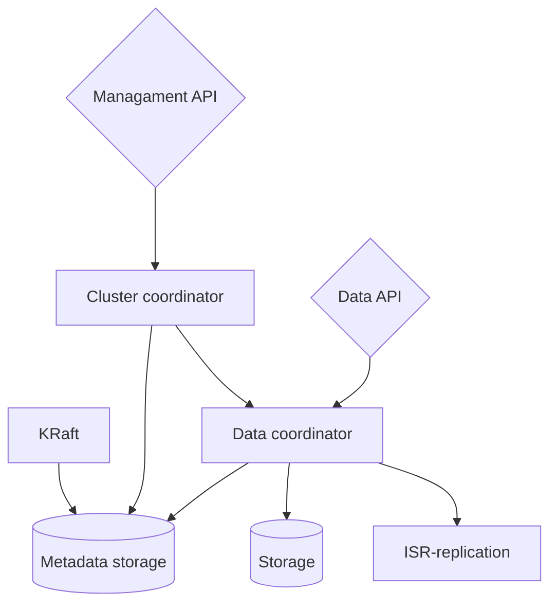

# Broker code design

```mermaid
graph TD
    Storage[("Storage")]
    ISR["ISR-replication"]
    Metadata[("Metadata storage")]
    KRaft["KRaft"]
    DC["Data coordinator"]
    CC["Cluster coordinator"]
    DAPI{"Data API"}
    MAPI{"Managament API"}

    DAPI --> DC
    DC --> Storage
    DC --> Metadata
    DC --> ISR

    MAPI --> CC
    CC --> Metadata

    CC --> DC

    KRaft --> Metadata
```
