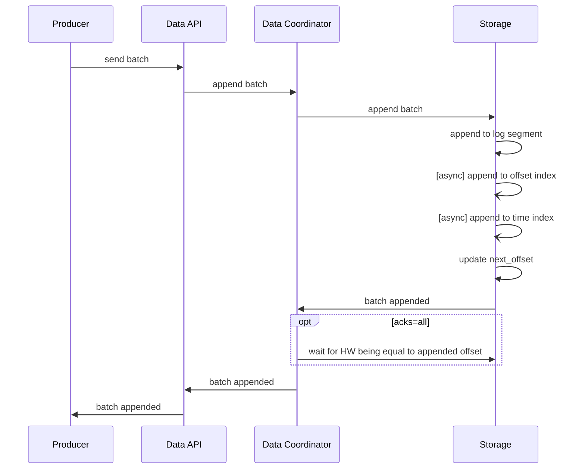

# Append flow

## Ideas

* For every partition there is one single writer-thread

## Sequence



---

About Kafka synchronization:

```text
Где что синхронизировано

  ┌───────────────────────────────────────┬─────────────────────────────────────┐
  │                  Что                  │            Как защищено             │
  ├───────────────────────────────────────┼─────────────────────────────────────┤
  │ Валидация, назначение offset-ов       │ synchronized(lock)                  │
  ├───────────────────────────────────────┼─────────────────────────────────────┤
  │ Producer state (idempotent/transact.) │ synchronized(lock)                  │
  ├───────────────────────────────────────┼─────────────────────────────────────┤
  │ Решение о roll сегмента               │ synchronized(lock)                  │
  ├───────────────────────────────────────┼─────────────────────────────────────┤
  │ FileChannel.write() на диск           │ synchronized(lock)                  │
  ├───────────────────────────────────────┼─────────────────────────────────────┤
  │ Обновление индексов                   │ synchronized(lock)                  │
  ├───────────────────────────────────────┼─────────────────────────────────────┤
  │ FileRecords.size                      │ AtomicInteger (lock-free)           │
  ├───────────────────────────────────────┼─────────────────────────────────────┤
  │ highWatermark, logStartOffset и др.   │ volatile (lock-free reads)          │
  ├───────────────────────────────────────┼─────────────────────────────────────┤
  │ Max timestamp в сегменте              │ отдельный maxTimestampAndOffsetLock │
  └───────────────────────────────────────┴─────────────────────────────────────┘

  ---
  Может ли читатель работать одновременно с записью?
                                                                                                         
  Да. Вот ключевой момент дизайна:
                                                                                                         
  - LogSegment.read() и translateOffset() явно помечены как thread-safe                                  
  - Чтение идёт через FileChannel.read() с абсолютной позицией - это безопасно даже при конкурентной
  записи в тот же FileChannel                                                                            
  - Писатель держит UnifiedLog.lock, но читатель его не берёт                                          
                                                                                                         
  Защита от чтения «незафиксированного» реализована иначе: ReplicaManager в начале fetch-запроса         
  фиксирует maxOffsetMetadata - и читатели видят только данные ниже этой границы.                        
                                                                                                         
  ---                                                                                                  
  Кто вызывает запись
                     
  Путь вызова: RequestHandlerThread → ReplicaManager.appendToLocalLog() →
  Partition.appendRecordsToLeader() → UnifiedLog.appendAsLeader() → synchronized(lock) { ...             
  LocalLog.append() ... }.
                                                                                                         
  Несколько request handler threads могут конкурировать за lock, но только один пройдёт - остальные      
  встанут в очередь на монитор.
                                                                                                         
  ---                                                                                                  
  Итог
                                                                                                         
  Kafka намеренно жертвует параллелизмом записи внутри партиции в пользу простоты и порядка. Параллелизм
  достигается на уровне разных партиций, а пропускная способность - за счёт батчинга (много сообщений за 
  одну запись под локом).                                                                              
```
