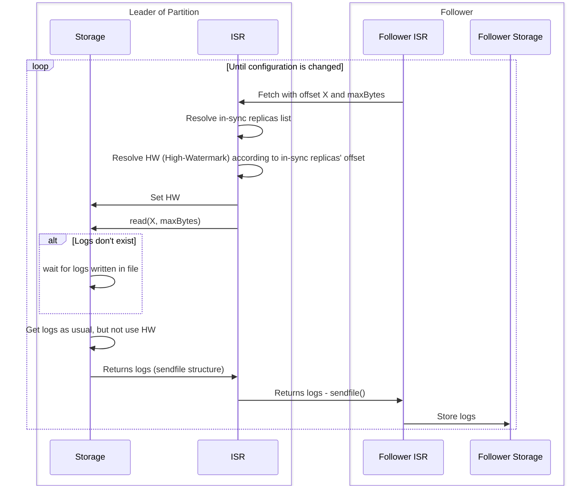
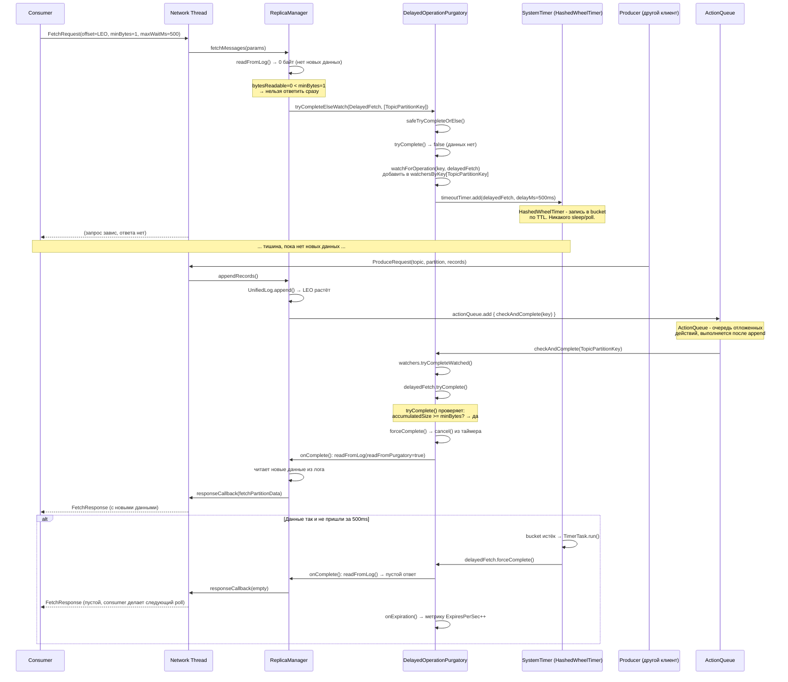

# ISR-replication flow

## Ideas

- It is fully background process

ISR-module stores in memory:

- replicas list
- in-sync replicas list
- replicas' offsets
- replicas' last fetch time

It can calculate HW out of replicas' offsets

## Sequence

TODO: claude dialogue "Корректность флоу append в Data API"

## Kafka reference

```mermaid
sequenceDiagram                                                                                                                                      
      participant ZK as Controller (KRaft)
      participant FM as ReplicaFetcherManager                                                                                                          
      participant FT as ReplicaFetcherThread
      participant LAPI as Leader KafkaApis                                                                                                             
      participant LRM as Leader ReplicaManager                                                                                                         
      participant LP as Leader Partition                                                                                                               
      participant LSEG as Leader LogSegment                                                                                                            
      participant TL as PlaintextTransportLayer                                                                                                        
      participant FRM as Follower ReplicaManager                                                                                                       
      participant FP as Follower Partition                                                                                                             
      participant FSEG as Follower LogSegment                                                                                                          
                                                                                                                                                       
      ZK->>FRM: LeaderAndIsr (назначение лидера)
      FRM->>FM: makeFollower(partition, leaderEpoch)                                                                                                   
      FM->>FT: addPartitions(tp, fetchOffset=LEO)                                                                                                      
      Note over FT: бесконечный loop: doWork()                                                                                                         
                                                                                                                                                       
      loop каждые replica.fetch.wait.max.ms                                                                                                            
          FT->>FT: maybeFetch()                                                                                                                        
          FT->>LAPI: FetchRequest(replicaId=2, offset=LEO, maxBytes=10MB)                                                                              
          Note over FT,LAPI: isFromFollower=true<br/>FetchIsolation.LOG_END (читает uncommitted)                                                       
                                                                                                                                                       
          LAPI->>LRM: fetchMessages(FetchParams(isFromFollower=true))                                                                                  
          LRM->>LP: fetchRecords(fetchPartitionData)                                                                                                   
                                                                                                                                                       
          Note over LP: inReadLock(leaderIsrUpdateLock)
          LP->>LSEG: read(startOffset=LEO, maxSize=10MB)                                                                                               
          Note over LSEG: translateOffset → OffsetIndex.lookup<br/>→ linear scan (pread 13B × N)                                                       
          LSEG-->>LP: FetchDataInfo(FileRecords slice)                                                                                                 
                                                                                                                                                       
          LP->>LP: updateFollowerFetchState(replica, LEO)                                                                                              
          LP->>LP: maybeExpandIsr(followerReplica)                                                                                                     
          alt фолловер догнал лидера (LEO ≥ HW)                                                                                                        
              LP->>LP: maybeIncrementLeaderHW()                                                                                                        
              LP->>ZK: AlterPartition (добавить в ISR)
          end                                                                                                                                          
                  
          LP-->>LRM: LogReadResult                                                                                                                     
          LRM-->>LAPI: Map[partition → FetchDataInfo]
          LAPI->>TL: sendResponse(MultiRecordsSend)                                                                                                    
          TL->>TL: fileChannel.transferTo(pos, len, socket)                                                                                            
          Note over TL: sendfile() - данные идут<br/>page cache → socket, 0 копий                                                                      
                                                                                                                                                       
          TL-->>FT: FetchResponse (bytes по TCP)                                                                                                       
                                                                                                                                                       
          Note over FT: toMemoryRecords()<br/>FileRecords → ByteBuffer.allocate → copy<br/>⚠️  здесь zero-copy заканчивается                            
          FT->>FT: processPartitionData()
          FT->>FP: appendRecordsToFollowerOrFutureReplica(MemoryRecords)                                                                               
          FP->>FSEG: append(records) → write() на диск                                                                                                 
          FSEG->>FSEG: обновить LEO                                                                                                                    
          FSEG-->>FP: LogAppendInfo                                                                                                                    
          FP->>FP: maybeUpdateHighWatermark(leaderHW из ответа)                                                                                        
      end        
```

