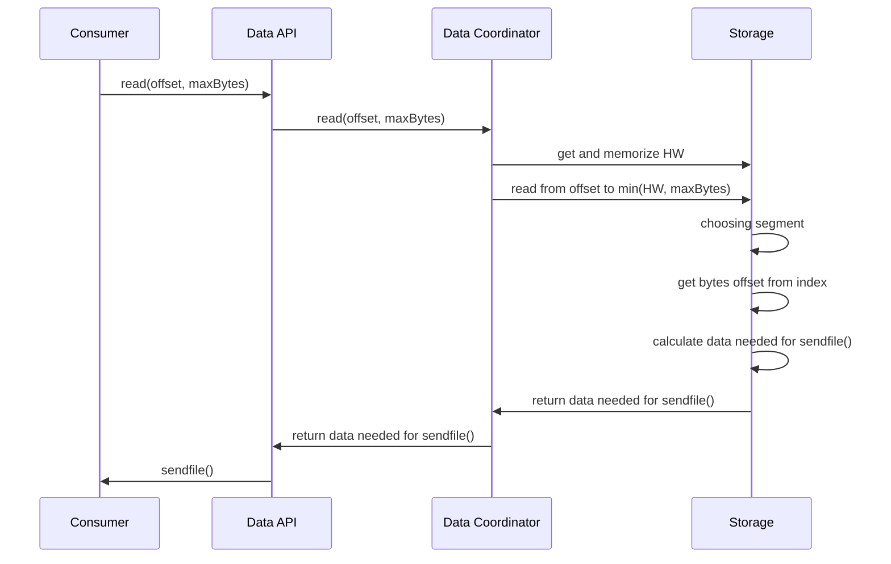

# Read flow

## Ideas

## Sequence

```mermaid
sequenceDiagram
    participant C as Consumer
    participant DAPI as Data API
    participant DC as Data Coordinator
    participant Storage as Storage

    C ->> DAPI: read(offset, maxBytes)
    DAPI ->> DC: read(offset, maxBytes)
    DC ->> Storage: get and memorize HW
    DC ->> Storage: read from offset to min(HW, maxBytes)
    Storage ->> Storage: choosing segment
    Storage ->> Storage: get bytes offset from index
    Storage ->> Storage: calculate data needed for sendfile()
    Storage ->> DC: return data needed for sendfile()
    DC ->> DAPI: return data needed for sendfile()
    DAPI ->> C: sendfile()
```

## Kafka reference

Sequence of how it is implemented in Kafka

```mermaid
 sequenceDiagram                                                                                                                                      
      participant C as KafkaConsumer                                                                                                                 
      participant FC as FetchCollector                                                                                                                 
      participant NET as Network (TCP)                                                                                                                 
      participant API as KafkaApis
      participant RM as ReplicaManager                                                                                                                 
      participant UL as UnifiedLog                                                                                                                     
      participant SEG as LogSegment
      participant IDX as OffsetIndex (mmap)                                                                                                            
      participant FR as FileRecords
      participant TL as PlaintextTransportLayer                                                                                                        
                                                                                                                                                       
      C->>FC: poll()                                                                                                                                   
      FC->>NET: FetchRequest(offset=10, maxBytes=10MB)                                                                                                 
                                                                                                                                                       
      NET->>API: handleFetchRequest()
      API->>RM: fetchMessages(offset=10, maxBytes=10MB)                                                                                                
      RM->>UL: read(startOffset=10, maxLength=10MB)                                                                                                    
      UL->>SEG: read(startOffset=10, maxSize=10MB)
                                                                                                                                                       
      SEG->>IDX: lookup(offset=10)
      Note over IDX: бинарный поиск в mmap<br/>(без syscall - память)                                                                                  
      IDX-->>SEG: OffsetPosition(offset=8, filePos=1024)                                                                                               
                                                                                                                                                       
      SEG->>FR: searchForOffsetFromPosition(10, pos=1024)                                                                                              
      loop пока baseOffset < 10                                                                                                                        
          FR->>FR: pread(fd, 13B, pos) → {baseOffset, size}                                                                                            
          FR->>FR: pos += batchSize                                                                                                                    
      end                                                                                                                                              
      FR-->>SEG: LogOffsetPosition(offset=10, filePos=1432, size=512)                                                                                  
                                                                                                                                                       
      SEG->>FR: slice(start=1432, len=min(segEnd-1432, 10MB))                                                                                          
      Note over FR: FileRecords - это view<br/>на FileChannel, без копии                                                                               
      FR-->>SEG: FetchDataInfo(FileRecords slice)                                                                                                      
      SEG-->>UL: FetchDataInfo
      UL-->>RM: LogReadResult                                                                                                                          
      RM-->>API: Map[partition → FetchDataInfo]                                                                                                        
                                                                                                                                                       
      API->>NET: sendResponse(MultiRecordsSend)                                                                                                        
      Note over API,NET: заголовок ответа - обычный ByteBuffer
      NET->>TL: writeTo(channel)                                                                                                                       
      TL->>FR: writeTo(channel, offset=1432, len)
      FR->>TL: transferFrom(fileChannel, 1432, len)                                                                                                    
      TL->>TL: fileChannel.transferTo(1432, len, socketChannel)                                                                                        
      Note over TL: sendfile() - ядро читает<br/>page cache → socket,<br/>0 копий в user space                                                         
                                                                                                                                                       
      NET-->>FC: FetchResponse(bytes)                                                                                                                  
      FC->>FC: CompletedFetch(batches.iterator())                                                                                                      
      loop по батчам (все N батчей из slice)                                                                                                           
          FC->>FC: currentBatch = batches.next()                                                                                                       
          FC->>FC: fetchRecords(maxRecords)
      end                                                                                                                                              
      FC-->>C: List<ConsumerRecord> (≤ max.poll.records)
```

