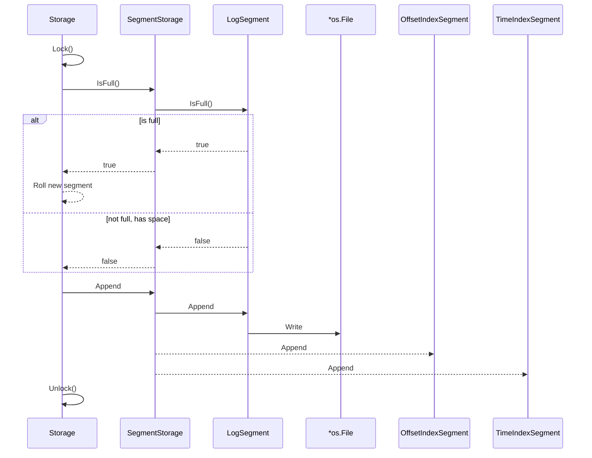
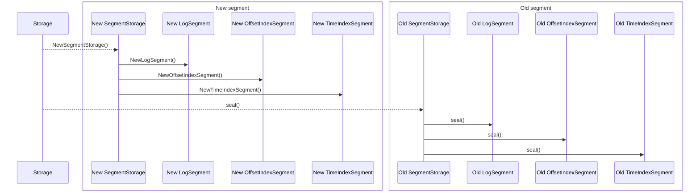
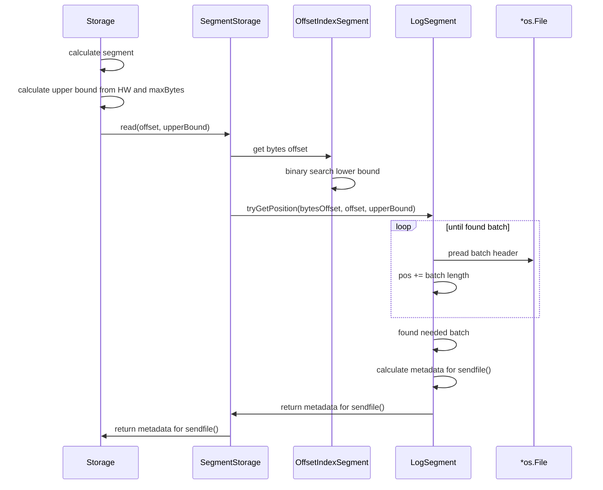
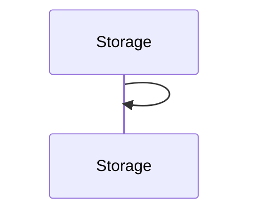

# Disk

## Ideas

* It is good idea to use varint for some compaction
* no `fsync` at start but add it later with manual configuration

## Sequence

Append



Roll



Read



Recovery



## Kafka reference

Recovery

```md
---                                                                                                                                 
  Recovery слой Kafka storage                                                                                                         
                                                                                                                                      
  Recovery запускается при старте брокера в LogManager и реализован в LogLoader. Вся логика строится вокруг одного вопроса: был ли    
  предыдущий shutdown чистым?                                                                                                         
                  
  ---                                                                                                                                 
  1. Определение типа shutdown — CleanShutdownFileHandler
                                                                                                                                      
  checkpoint/CleanShutdownFileHandler.java
                                                                                                                                      
  При корректном завершении брокер записывает файл .kafka_cleanshutdown в каждую log-директорию. Внутри — JSON с brokerEpoch          
  (KIP-966).                                                                                                                          
                                                                                                                                      
  При старте LogManager (строки 629–634):
  CleanShutdownFileHandler cleanShutdownFileHandler = new CleanShutdownFileHandler(dir.getPath());
  if (cleanShutdownFileHandler.exists()) {                                                        
      cleanShutdownFileHandler.delete();  // удаляем ДО загрузки, чтобы crash при загрузке = unclean                                  
      hadCleanShutdown.set(true);                                                                                                     
  }                                                                                                                                   
                                                                                                                                      
  Файл удаляется до начала загрузки — если брокер упадёт в процессе recovery, следующий старт будет считаться unclean.                
                                                                                                                                      
  ---             
  2. Checkpoint файлы                                                                                                                 
                     
  - recovery-point-offset-checkpoint — для каждой партиции хранит offset, до которого данные гарантированно сброшены на диск. Сегменты
   выше этого offset'а требуют recovery.                                                                                              
  - log-start-offset-checkpoint — нижняя граница retained данных.
                                                                                                                                      
  LogManager обновляет recovery-point-offset-checkpoint периодически через scheduler (строка 823), но только после явного flush()     
  сегмента.                                                                                                                           
                                                                                                                                      
  ---             
  3. Параллельная загрузка — LogManager.loadLogs()
                                                                                                                                      
  Строки 625–710. На каждую data-директорию создаётся thread pool размером numRecoveryThreadsPerDataDir. Каждая партиция загружается
  параллельно через loadLog() → LogLoader.load().                                                                                     
                  
  ---                                                                                                                                 
  4. LogLoader.load() — 4 прохода по файлам
                                                                                                                                      
  LogLoader.java:128
                                                                                                                                      
  Проход 1 (removeTempFilesAndCollectSwapFiles):                                                                                      
  - Удаляет .deleted файлы (брошенные из прошлой операции)
  - Собирает .swap файлы (прерванная компакция/сплит)                                                                                 
  - Собирает .cleaned файлы                          
                                                                                                                                      
  Проход 2: Удаляет сегменты, которые попали в диапазон [minSwapFileOffset, maxSwapFileOffset) — они были уже компактированы, но .swap
   → .log rename не завершился.                                                                                                       
                                                                                                                                      
  Проход 3: Rename оставшихся .swap → обычные сегменты (завершает прерванную компакцию).                                              
                  
  Проход 4 (loadSegmentFiles): Загружает все .log файлы. Для каждого:                                                                 
  - Проверяет наличие парного index файла
  - Вызывает segment.sanityCheck() — при ошибке (CorruptIndexException, NoSuchFileException) запускает recoverSegment(segment)        
                                                                                                                              
  Весь проход 4 обёрнут в retryOnOffsetOverflow — при обнаружении legacy сегмента с переполнением offset'а сегмент разбивается        
  (splitOverflowedSegment) и загрузка повторяется с нуля.                                                                             
                                                                                                                                      
  ---                                                                                                                                 
  5. recoverLog() — recovery при unclean shutdown
                                                                                                                                      
  LogLoader.java:456
                                                                                                                                      
  Запускается только если !hadCleanShutdown. Итерирует сегменты начиная с recoveryPointCheckpoint:                                    
   
  Collection<LogSegment> unflushed = segments.values(recoveryPointCheckpoint, Long.MAX_VALUE);                                        
  while (unflushedIter.hasNext() && !truncated) {                                                                                     
      truncatedBytes = recoverSegment(segment);                                                                                       
      if (truncatedBytes > 0) {                                                                                                       
          // нашли corruption — удаляем все оставшиеся сегменты                                                                       
          removeAndDeleteSegmentsAsync(unflushedRemaining);                                                                           
          truncated = true;                                                                                                           
      }                                                                                                                               
  }                                                                                                                                   
                  
  ---
  6. LogSegment.recover() — побайтовое восстановление сегмента
                                                                                                                                      
  LogSegment.java:483
                                                                                                                                      
  Сбрасывает все индексы (offset, time, txn) и итерирует все RecordBatch в .log файле:                                                
   
  - batch.ensureValid() — CRC-проверка каждого батча                                                                                  
  - Перестраивает offset index и time index
  - Обновляет LeaderEpochFileCache из batch.partitionLeaderEpoch()                                                                    
  - Обновляет ProducerState (updateProducerState) — для idempotent/transactional producer'ов                                          
                                                                                                                                      
  При первой ошибке (CorruptRecordException) итерация прерывается, и файл усекается до validBytes:                                    
                                                                                                                                      
  log.truncateTo(validBytes);                                                                                                         
  offsetIndex().trimToValidSize();
  timeIndex().trimToValidSize();                                                                                                      
   
  ---                                                                                                                                 
  7. rebuildProducerState() — финальный этап
                                                                                                                                      
  UnifiedLog.java:2534. Вызывается после всего recovery.
                                                                                                                                      
  - Clean shutdown без snapshots (первый старт после апгрейда): создаёт пустые snapshots для двух последних сегментов — избегает      
  полного сканирования                                                                                                                
  - Обычный путь: загружает из ближайшего .snapshot файла, дочитывает записи от snapshot.offset до LEO                                
                                                                                                                                      
  ---
  Общая схема                                                                                                                         
                                                                                                                                      
  LogManager.loadLogs()
    └─ для каждой data-dir (параллельно):                                                                                             
        ├─ CleanShutdownFileHandler.exists() → hadCleanShutdown                                                                       
        ├─ read recovery-point-offset-checkpoint
        └─ thread pool: loadLog() × N партиций                                                                                        
             └─ LogLoader.load()                                                                                                      
                  ├─ Pass 1-3: cleanup .swap/.deleted/.cleaned                                                                        
                  ├─ Pass 4:   loadSegmentFiles() + retryOnOffsetOverflow                                                             
                  ├─ recoverLog()  ← только если !hadCleanShutdown                                                                    
                  │    └─ recoverSegment() × M unflushed segments                                                                     
                  │         └─ LogSegment.recover()                                                                                   
                  │              ├─ итерация батчей, CRC-проверка                                                                     
                  │              ├─ rebuild offset/time index
                  │              ├─ update LeaderEpochCache                                                                           
                  │              └─ truncate at first corrupt byte
                  ├─ leaderEpochCache.truncateFromEnd(nextOffset)                                                                     
                  └─ rebuildProducerState()                                                                                           
                                                                                                                                      
  Ключевой инвариант: recovery point продвигается только при flush() — это гарантирует, что при crash после checkpoint'а, но до       
  flush'а, сегменты будут переиграны повторно.
```

