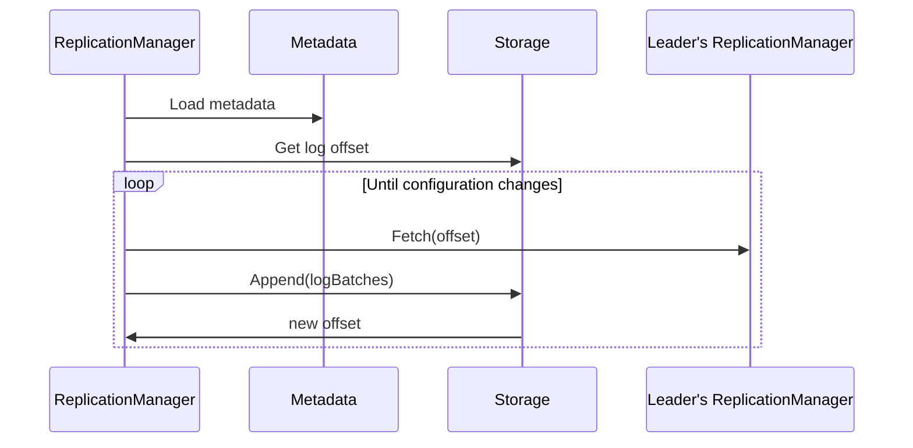
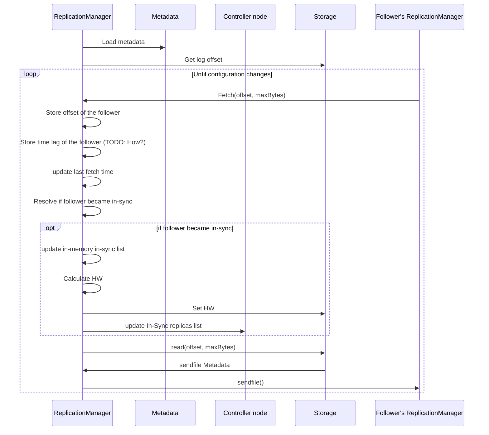
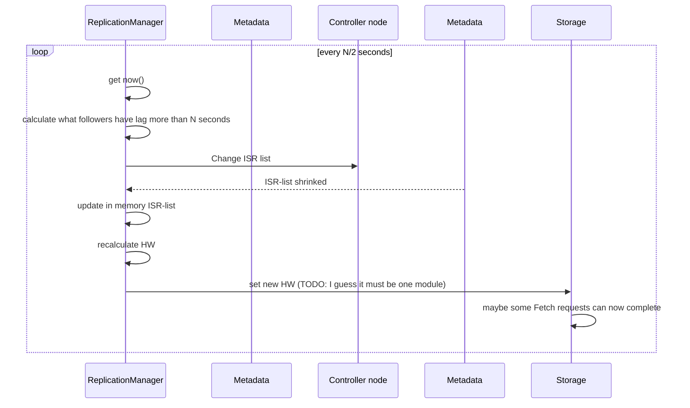
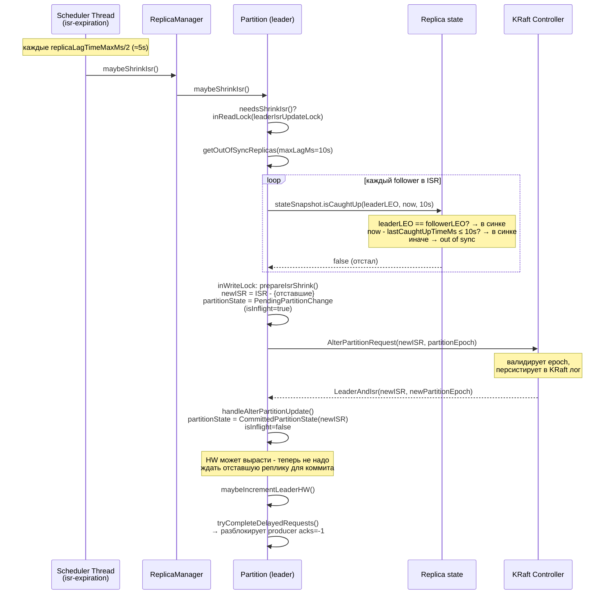

# ISR-replication

## Ideas

## Sequence

As a follower

```mermaid
sequenceDiagram
    participant RM as ReplicationManager
    participant M as Metadata
    participant Storage as Storage
    participant Leader as Leader's ReplicationManager

    RM ->> M: Load metadata
    RM ->> Storage: Get log offset
    loop Until configuration changes
        RM ->> Leader: Fetch(offset)
        RM ->> Storage: Append(logBatches)
        Storage ->> RM: new offset
    end
```

As a leader

```mermaid
sequenceDiagram
    participant RM as ReplicationManager
    participant M as Metadata
    participant Controller as Controller node
    participant Storage as Storage
    participant Follower as Follower's ReplicationManager

    RM ->> M: Load metadata
    RM ->> Storage: Get log offset
    loop Until configuration changes
        Follower ->> RM: Fetch(offset, maxBytes)
        RM ->> RM: Store offset of the follower
        RM ->> RM: Store time lag of the follower (TODO: How?)
        RM ->> RM: update last fetch time
        RM ->> RM: Resolve if follower became in-sync
        opt if follower became in-sync 
            RM ->> RM: update in-memory in-sync list
            RM ->> RM: Calculate HW
            RM ->> Storage: Set HW
            RM ->> Controller: update In-Sync replicas list
        end
        RM ->> Storage: read(offset, maxBytes)
        Storage ->> RM: sendfile Metadata
        RM ->> Follower: sendfile()
    end
```

ISR-shrink

```mermaid
sequenceDiagram
    participant RM as ReplicationManager
    participant M as Metadata
    participant Controller as Controller node

    loop every N/2 seconds
        RM ->> RM: get now()
        RM ->> RM: calculate what followers have lag more than N seconds
        RM ->> Controller: Change ISR list
        Metadata -->> RM: ISR-list shrinked
        RM ->> RM: update in memory ISR-list
        RM ->> RM: recalculate HW
        RM ->> Storage: set new HW (TODO: I guess it must be one module)
        Storage ->> Storage: maybe some Fetch requests can now complete
    end
```

## Kafka reference

ISR-shrink

```mermaid
sequenceDiagram
      participant SCH as Scheduler Thread<br/>(isr-expiration)                                                                                         
      participant RM as ReplicaManager
      participant P as Partition (leader)                                                                                                              
      participant R as Replica state
      participant CTRL as KRaft Controller                                                                                                             
                                                                                                                                                       
      Note over SCH: каждые replicaLagTimeMaxMs/2 (≈5s)
                                                                                                                                                       
      SCH->>RM: maybeShrinkIsr()                                                                                                                       
      RM->>P: maybeShrinkIsr()
      P->>P: needsShrinkIsr()?<br/>inReadLock(leaderIsrUpdateLock)                                                                                     
      P->>P: getOutOfSyncReplicas(maxLagMs=10s)                                                                                                        
                                                                                                                                                       
      loop каждый follower в ISR                                                                                                                       
          P->>R: stateSnapshot.isCaughtUp(leaderLEO, now, 10s)                                                                                         
          Note over R: leaderLEO == followerLEO? → в синке<br/>now - lastCaughtUpTimeMs ≤ 10s? → в синке<br/>иначе → out of sync                       
          R-->>P: false (отстал)                                                                                                                       
      end                                                                                                                                              
                                                                                                                                                       
      P->>P: inWriteLock: prepareIsrShrink()<br/>newISR = ISR - {отставшие}<br/>partitionState = PendingPartitionChange<br/>(isInflight=true)          
                  
      P->>CTRL: AlterPartitionRequest(newISR, partitionEpoch)                                                                                          
      Note over CTRL: валидирует epoch,<br/>персистирует в KRaft лог
                                                                                                                                                       
      CTRL-->>P: LeaderAndIsr(newISR, newPartitionEpoch)
                                                                                                                                                       
      P->>P: handleAlterPartitionUpdate()<br/>partitionState = CommittedPartitionState(newISR)<br/>isInflight=false                                    
      Note over P: HW может вырасти - теперь не надо<br/>ждать отставшую реплику для коммита
      P->>P: maybeIncrementLeaderHW()                                                                                                                  
      P->>P: tryCompleteDelayedRequests()<br/>→ разблокирует producer acks=-1
```
