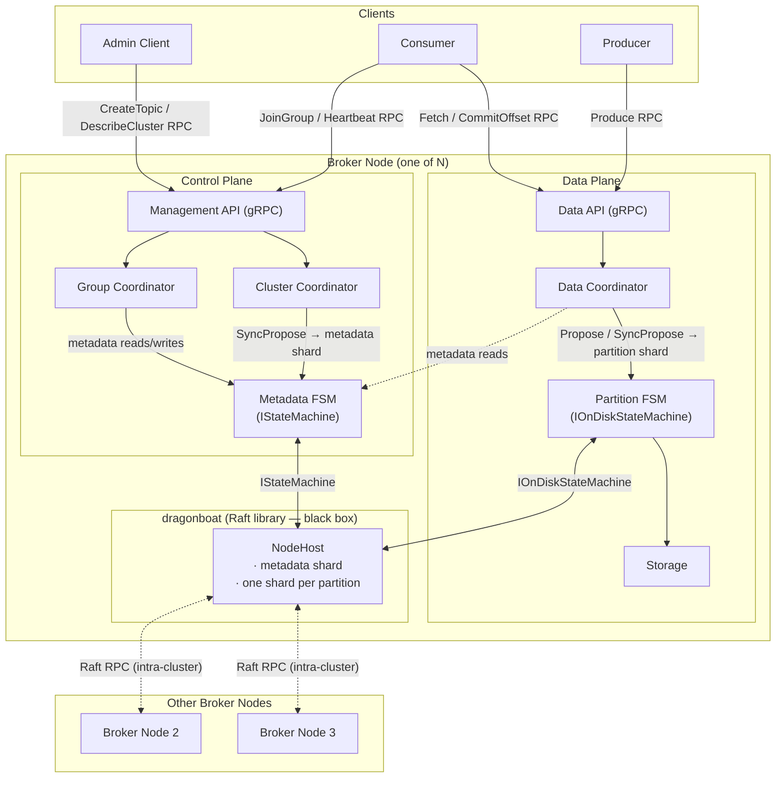

# BunnyMQ — High-Level Overview

BunnyMQ is a Kafka-like distributed message broker written in Go, designed for a course project with a one-week implementation budget. It provides topics, partitions, consumer groups, replicated durable storage, and configurable delivery guarantees (`acks=0` and `acks=all`). The system targets clusters of three or more nodes, where horizontal scalability is achieved via partitioning and fault tolerance via Raft quorum replication managed by the dragonboat library.

---

## 1. High-Level Architecture

**Control plane vs Data plane.** The Management API, Cluster Coordinator, Group Coordinator, and Metadata FSM form the control plane: they manage cluster topology and consumer group state. The Data API, Data Coordinator, Partition FSM, and Storage form the data plane: they handle produce and fetch traffic. The only cross-plane dependency is that the Data Coordinator reads partition metadata (leader node, replica placement) from the Metadata FSM. Only the Cluster Coordinator writes to the Metadata FSM.

---

## 2. Key Modules

1. **Storage** — Segmented append-only log, Kafka-style. Manages `LogSegment` files, mmap'd `OffsetIndexSegment` and `TimeIndexSegment`, and the segment roll lifecycle.
2. **Raft Host** — Thin wrapper around dragonboat's `NodeHost`. Initialises the NodeHost, registers FSMs for the metadata shard and each partition shard, and provides typed Propose/SyncPropose helpers to the rest of the system.
3. **Metadata FSM** — `IStateMachine` managing cluster-wide metadata in memory (topics, partitions, replica placement, node list). Snapshot format is JSON.
4. **Partition FSM** — `IOnDiskStateMachine` wrapping Storage. Its `Update()` method is strictly deterministic: it calls into Storage to append batches and advance the committed index; no `time.Now()` or network I/O is allowed inside.
5. **Cluster Coordinator** — Sole writer to the Metadata FSM. Handles topic lifecycle (create, delete, alter), partition assignment across nodes, and reacts to leader-election signals surfaced by dragonboat.
6. **Data Coordinator** — Routes produce and fetch requests to the correct partition shard leader, dispatches `Propose`/`SyncPropose` calls, and enforces the `acks` contract.
7. **Group Coordinator** — Manages consumer group state: join/leave/heartbeat/rebalance lifecycle and offset commit/fetch. Stores committed offsets via the Metadata FSM.
8. **Management API** — gRPC server exposing the Admin API (topic and cluster management) and Consumer Group API (join, heartbeat, leave, offset commit/fetch).
9. **Data API** — gRPC server exposing the Producer API (produce) and Consumer API (fetch, offset queries). Routes requests through the Data Coordinator.
10. **Client Library** — Public Go library (`pkg/client`) providing `Producer`, `Consumer`, and `AdminClient` types with connection management, partition routing, and auto-commit convenience.
11. **Metrics & Logging** — Prometheus metrics endpoint and structured JSON/logfmt logging. Metrics include per-partition produce/fetch rates, latency histograms, and consumer group lag.
12. **CLI** — `cobra`-based command-line tool (`cmd/bunnymq`) wrapping the Client Library. Provides `produce`, `consume`, `topic`, and `cluster` subcommands for manual interaction with a BunnyMQ cluster.

---

## 3. Key External Dependencies

| Name | Version target | Role in BunnyMQ | License |
| ---- | -------------- | --------------- | ------- |
| `github.com/lni/dragonboat/v4` | v4.x latest stable | Multi-raft consensus: one shard per partition + one metadata shard | Apache 2.0 |
| `google.golang.org/grpc` | v1.x latest stable | gRPC server/client transport for Data API and Management API | Apache 2.0 |
| `google.golang.org/protobuf` | v1.x latest stable | Protobuf message serialisation for all on-wire types | BSD-3-Clause |
| `github.com/prometheus/client_golang` | v1.x latest stable | Prometheus metrics registry and HTTP exposition | Apache 2.0 |
| `go.uber.org/zap` | v1.x latest stable | Structured, levelled logging output to stdout | MIT |
| `github.com/spf13/viper` | v1.x latest stable | Configuration loading from YAML/TOML with CLI flag override | MIT |
| `github.com/spf13/cobra` | v1.x latest stable | CLI command tree for `cmd/bunnymq` (produce, consume, topic, cluster subcommands) | Apache 2.0 |
| `golang.org/x/sys` | latest | `mmap` syscall wrappers for index files | BSD-3-Clause |

---

## 4. Glossary

| Term | Definition |
| ---- | ---------- |
| **Topic** | A logical message stream identified by a unique name. |
| **Partition** | An independent ordered sub-stream of a topic, identified by `(topic, partition_id)`. Order is preserved within a partition only. |
| **Shard** | A Raft replication group as defined by dragonboat. BunnyMQ uses one shard per partition plus one shard for cluster metadata. |
| **Replica** | A copy of a partition's data on a specific node, participating in that partition's Raft shard. |
| **Leader** | The current Raft leader of a shard. All reads and writes for a shard go through the leader node. |
| **FSM** | Finite State Machine. The application-level state machine dragonboat calls into when a Raft log entry is committed. BunnyMQ has two FSM types: Metadata FSM and Partition FSM. |
| **NodeHost** | The top-level dragonboat object on each broker node. It manages all shards co-located on that node and handles Raft RPC with peers. |
| **Producer** | A client that sends message batches to topics. |
| **Consumer** | A client that reads message batches from partitions at a given offset. |
| **Consumer Group** | A set of consumers cooperatively consuming a set of partitions, where each partition is assigned to exactly one member. |
| **Offset** | A monotonically increasing 64-bit integer identifying a record's position within a partition. Server-assigned at produce time. |
| **Committed Offset (consumer)** | The last offset within a partition that a consumer group has explicitly acknowledged as processed. |
| **Committed Index (Raft)** | The last log index acknowledged by a quorum of a Raft shard. Records up to this index are durable and visible to consumers. |
| **Segment** | A fixed-size file pair on disk: a `.log` file containing batches and paired index files (offset and time). A new segment is opened when the active segment reaches its size limit (default 128 MiB). |
| **Batch** | The atomic unit of produce and storage. A batch contains one or more records, a CRC, and header metadata. The on-disk format is identical to the on-wire format. |

> **Note on "ISR" (In-Sync Replicas):** BunnyMQ does not use this term. In Kafka, ISR is a bespoke replication protocol concept. In BunnyMQ, replication correctness and quorum commit are entirely governed by the Raft consensus implemented by dragonboat. There is no separate ISR tracking, follower-fetch loop, or high-watermark managed outside of Raft.

---

## 5. Architectural Decisions and Rationale

### 5.1 Language: Go

Go was chosen for its first-class concurrency primitives (goroutines, channels, `sync` primitives), a strong standard library covering networking and file I/O, and a simple deployment model (single static binary, no JVM warmup). The main alternative was Java or Kotlin — the language Kafka itself is written in — which offers deep Kafka ecosystem integration and mature performance tuning. For a one-week implementation budget and a course project, Go's lower operational overhead and faster compile-test cycle outweigh the familiarity benefit of matching Kafka's runtime.

### 5.2 Consensus and Replication: dragonboat v4, Multi-Raft

dragonboat provides a production-grade, battle-tested Raft implementation with built-in multi-raft support, pluggable FSM interfaces, and snapshot management. By delegating consensus to dragonboat, BunnyMQ eliminates the need to implement leader election, log replication, ISR tracking, follower-fetch loops, and high-watermark bookkeeping. The alternative — manual ISR replication (modelled in the historical ADRs) — requires a bespoke follower-fetch protocol, a separate controller role, and careful handling of leader failover; this complexity is exactly what Raft subsumes. One dragonboat shard per partition means each partition has an independent Raft group: partitions do not block each other's consensus rounds.

### 5.3 Wire Protocol: gRPC + Protobuf

gRPC gives structured, strongly typed APIs with built-in flow control, streaming support, and code generation for both server and client stubs in Go. A custom binary protocol (as Kafka uses) would enable zero-copy `sendfile` transfers and reduce per-message framing overhead, but implementing a full binary parser is not feasible in a one-week window. Batch format on disk is kept identical to the batch format on the wire, preserving the option to add a zero-copy path in a future version without changing the storage layer. HTTP/REST was considered but rejected because binary Protobuf framing is far more efficient for high-throughput message streaming.

### 5.4 Acks Semantics: acks=0 and acks=all Only

`acks=all` uses `dragonboat.SyncPropose`: the call returns only after a Raft quorum has committed the batch, guaranteeing durability. `acks=0` uses `dragonboat.Propose` (fire-and-forget): the call returns immediately with no durability guarantee. `acks=1` is deliberately omitted. Under Raft, a write to the local leader log is not safe: if the leader crashes before replicating, the newly elected leader will not have the entry and the producer's offset is silently lost. This would violate the contract that `acks=1` implies (at least the leader persisted it). Providing `acks=1` would either be misleading or require wrapping each write in a single-node quorum, which adds latency with no benefit over `acks=all`.

### 5.5 Storage: Segmented Append-Only Log, Kafka-Style

The segment model is well suited to sequential-write workloads: all writes append to the active segment, avoiding random I/O. Sparse offset and time indexes (one entry per ~4 KiB) provide O(log n) point lookups via binary search on mmap'd index files followed by a short linear scan. Keeping batch format identical on disk and over the wire means the storage layer can be tested independently from the network layer and enables a future zero-copy read path. The alternative — an embedded key-value store (e.g. RocksDB, bbolt) — handles random writes more gracefully but adds unnecessary overhead for strictly sequential workloads and breaks the wire-format identity property.

### 5.6 Metadata FSM: IStateMachine (In-Memory, JSON Snapshots)

Cluster metadata (topics, partitions, node list, consumer group state) changes infrequently and fits comfortably in memory even at the maximum supported scale (1000 topics × 100 partitions). An in-memory `IStateMachine` is simpler to implement and reason about than an on-disk one. JSON snapshots are human-readable, easy to debug, and sufficient for the low snapshot frequency of metadata. The alternative — `IOnDiskStateMachine` for metadata — would add file management complexity with no throughput benefit, since metadata operations are not on the hot path.

### 5.7 Partition FSM: IOnDiskStateMachine

Partition data is written continuously and cannot be held in memory. `IOnDiskStateMachine` instructs dragonboat to call into the FSM's own recovery path (via Storage) when replaying from a snapshot or restarting after a crash, rather than loading the entire state into memory. The FSM's `Update()` method appends committed Raft entries to the Storage layer; its determinism constraint (no `time.Now()`, no `rand` without an explicit seed in the command, no network I/O) ensures that all replicas apply the same sequence of writes and arrive at identical state. The alternative — a memory-based FSM that flushes to disk asynchronously — would require duplicating snapshot logic already handled by `IOnDiskStateMachine`.

### 5.8 Consumer Groups: Minimal v1, Range-Based Assignment

Range-based assignment is deterministic and stateless: partitions are sorted by `partition_id`, members by `member_id`, and partitions are split into contiguous ranges. The coordinator computes the full assignment in a single round, with no back-and-forth negotiation between members. Kafka's cooperative (incremental) rebalancer avoids stop-the-world pauses by reassigning only the partitions that move, but requires a multi-round protocol and member-side state tracking. The simpler model is sufficient for the course project scope and the architecture explicitly reserves room for richer protocols in future versions.

### 5.9 Tests: Unit Tests for Storage and FSM + Docker-Compose Integration Tests

Storage and FSM correctness cannot be validated through mocks: file-offset arithmetic, index binary search, segment roll conditions, and Raft commit ordering must be exercised against real I/O. Unit tests catch regressions at the module boundary without requiring a running cluster. Integration tests via docker-compose with node-kill scenarios verify the most important system property — durability and availability under node failure — end-to-end. These two layers together give enough confidence for a course project while keeping test infrastructure manageable.

---

## 6. Out of Scope

The following are intentionally not implemented in BunnyMQ v1. Items are drawn from [REQUIREMENTS.md § 9](../REQUIREMENTS.md).

| Feature | Rationale for exclusion |
| ------- | ----------------------- |
| Idempotent producers | Requires per-producer sequence tracking and deduplication state; not feasible in v1 scope. |
| Transactional producers | Depends on idempotent producers; adds a two-phase commit protocol across partitions. |
| Exactly-once delivery | Requires both idempotent producers and transactional consumers; deferred entirely. |
| Log compaction | Requires a background compaction loop with tombstone handling; out of scope for append-only v1. |
| Tiered storage / S3 offload | Adds an external dependency and async upload lifecycle; not needed for a local demo cluster. |
| Schema registry | Independent service; not part of the broker. |
| Connectors / Kafka Connect equivalent | Independent service; not part of the broker. |
| Streams API | Independent library on top of the consumer API; not part of the broker. |
| ACLs and fine-grained authorization | Token auth gives coarse access control sufficient for the demo; fine-grained ACLs are a separate feature. |
| Mutual TLS | One-way TLS is optional; mTLS adds certificate management overhead not required for a course project. |
| Token expiration / revocation / rotation | Tokens are opaque strings; lifecycle management is out of scope. |
| Per-client quotas | Requires rate-limiting infrastructure; not needed for demo scale. |
| Multi-tenant isolation | Single-tenant model is sufficient for v1. |
| Cross-cluster replication | Requires a second cluster and a replication agent; separate product feature. |
| Dynamic cluster membership changes | All nodes are configured at bootstrap; runtime scaling is a significant Raft reconfiguration feature. |
| Decreasing partition count | Data redistribution for shrinkage is complex and rarely needed; increase-only is sufficient. |
| Batch compression | Adds codec dependency and decompression overhead on read; reserved for future `attributes` field use. |
| Sticky / cooperative rebalancing | Multi-round rebalance protocol; range-based assignment is sufficient for v1. |
