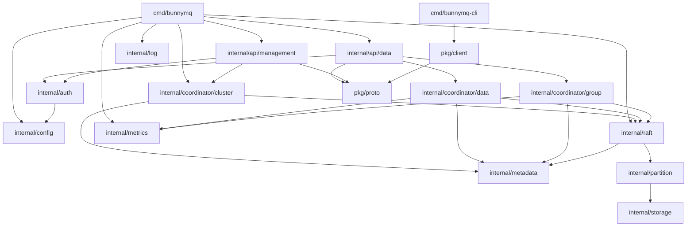

# BunnyMQ — Module Breakdown

This document describes the Go package layout for BunnyMQ, the responsibility boundary of each module, inter-module dependencies, the control-plane/data-plane split, and the dragonboat integration surface. It is the input for ticket decomposition in Stage 3. See [00-overview.md](./00-overview.md) for architectural decisions and rationale.

---

## 1. Module Tree

```text
api/
  data.proto          — Data API service definition (Produce, Fetch, offset queries, group ops)
  management.proto    — Management API service definition (topic, cluster admin)

cmd/
  bunnymq/            — broker entrypoint binary
  bunnymq-cli/        — cobra-based CLI tool (separate binary; not linked into the broker)

internal/
  config/             — configuration loading, validation, and typed config structs
  raft/               — dragonboat NodeHost wrapper and shard lifecycle
  metadata/           — Metadata FSM (IStateMachine) and read-access layer
  partition/          — Partition FSM (IOnDiskStateMachine)
  storage/            — segmented log: Storage, SegmentStorage, LogSegment, indexes
  coordinator/
    cluster/          — Cluster Coordinator: topic/partition lifecycle, node assignment
    data/             — Data Coordinator: produce/fetch routing, acks enforcement
    group/            — Group Coordinator: consumer group lifecycle and offset management
  api/
    data/             — Data API gRPC server (produce, fetch, offset queries, group ops)
    management/       — Management API gRPC server (topic and cluster admin)
  auth/               — token-based authentication interceptor
  metrics/            — Prometheus metric registration and helpers
  log/                — structured logger construction (wraps go.uber.org/zap)

pkg/
  client/             — public Producer, Consumer, AdminClient library
  proto/              — generated Protobuf + gRPC stubs compiled from api/*.proto
```

**Proto file convention:** source `.proto` files live in `api/` at the repo root. Generated `*.pb.go` and `*_grpc.pb.go` files are committed to `pkg/proto/` and regenerated via `buf generate` or `protoc` as part of the build. `api/` contains no Go code; `pkg/proto/` contains no hand-written code.

---

## 2. Per-Module Descriptions

### `cmd/bunnymq`

**Responsibility:** Parse flags, load configuration via `internal/config`, wire all internal modules together, and start the broker process (gRPC servers, Raft NodeHost, coordinators, pprof endpoint when enabled).

**Non-responsibilities:** No business logic; no direct storage, Raft, or coordinator calls beyond startup and shutdown sequencing.

**Primary collaborators:** `internal/config` (in), `internal/raft` (out), `internal/api/data` (out), `internal/api/management` (out), `internal/coordinator/cluster` (out), `internal/metrics` (out), `internal/log` (out).

---

### `cmd/bunnymq-cli`

**Responsibility:** cobra command tree providing `produce`, `consume`, `topic create|delete|list|describe`, and `cluster describe` subcommands. Each subcommand delegates to `pkg/client`.

**Non-responsibilities:** No direct gRPC or Raft calls; no business logic beyond argument parsing and output formatting. Not linked into the broker binary.

**Primary collaborators:** `pkg/client` (out).

---

### `internal/config`

**Responsibility:** Load broker configuration from a YAML/TOML file and CLI flags (viper), validate required fields and cross-field constraints (e.g. `replication_factor <= cluster_size`), and expose a single typed `Config` struct to the rest of the process.

**Non-responsibilities:** Does not watch for file changes at runtime; does not expose config over the network.

**Primary collaborators:** `cmd/bunnymq` (in) — the entrypoint is the only caller.

---

### `internal/raft`

**Responsibility:** Initialise dragonboat's `NodeHost` with the correct data directory and peer addresses from config; register FSMs for the metadata shard and each partition shard; provide typed `ProposeMetadata`, `SyncProposeMetadata`, `ProposePartition`, `SyncProposePartition`, `LookupMetadata`, `LookupPartition` helpers that hide raw dragonboat API; manage shard start/stop lifecycle.

**Non-responsibilities:** Does not interpret the content of Raft entries (that is the FSMs' job); does not know about topics or partitions at a semantic level.

**Primary collaborators:** `internal/metadata` (out — registers Metadata FSM), `internal/partition` (out — registers Partition FSMs), `internal/coordinator/cluster` (in — triggers shard creation/removal), `internal/coordinator/data` (in — Propose/SyncPropose for writes, LookupPartition for reads).

---

### `internal/metadata`

**Responsibility:** Implement dragonboat's `IStateMachine` interface for the cluster metadata shard. Maintain in-memory state: topic map, partition map (including leader and replica node IDs per partition), node list, consumer group state (members, generation, committed offsets). Apply commands (create topic, delete topic, update partition leader, register group member, commit offset, etc.) and produce JSON snapshots for Raft.

**Non-responsibilities:** Does not initiate writes to itself; all mutations arrive as committed Raft log entries routed through dragonboat. Does not perform network I/O.

**Primary collaborators:** `internal/raft` (in — dragonboat calls `Update` / `Lookup` / `SaveSnapshot` / `RecoverFromSnapshot`), `internal/coordinator/cluster` (in — reads cluster state via Lookup; writes via SyncPropose), `internal/coordinator/group` (in — reads/writes group state via SyncPropose), `internal/coordinator/data` (in — reads partition leader via Lookup).

---

### `internal/partition`

**Responsibility:** Implement dragonboat's `IOnDiskStateMachine` interface for a single partition shard. On `Update`, decode the Raft entry into a produce command, delegate to `internal/storage`, and update the in-memory `lastAppliedIndex` cache. On `Lookup`, serve read requests from `internal/storage` bounded by `lastAppliedIndex` — **no Raft round-trip**; the cached index is the visibility boundary. On `Open`, recover Storage from existing segment files. On `SaveSnapshot` / `RecoverFromSnapshot`, stream segment files as described in §5.

**Non-responsibilities:** Does not manage segment files directly; all I/O is through `internal/storage`. Does not know about topics or consumer groups. Must not call `time.Now()`, `rand` without an explicit seed embedded in the command, or any network I/O inside `Update`.

**Primary collaborators:** `internal/raft` (in — dragonboat lifecycle calls), `internal/storage` (out — all disk I/O).

---

### `internal/storage`

**Responsibility:** Manage the segmented append-only log for one partition replica. Provide `Append(batch)`, `Read(offset, maxBytes)`, `OffsetForTimestamp(ts)`, `EarliestOffset()`, `LatestOffset()`, `Trim(retentionMs, retentionBytes)`, and `Recover()` operations. Internally manage: active `SegmentStorage` (wraps `LogSegment` + `OffsetIndexSegment` + `TimeIndexSegment`), segment roll when the active segment exceeds the size limit, and index lookup via binary search on mmap'd index files followed by a linear scan of the log. Run a background retention goroutine that calls `Trim` on a configurable interval using the retention config passed at construction; the config can be updated at runtime via `SetRetentionConfig`.

**Non-responsibilities:** Does not know about Raft, topics, or consumer groups. Does not push notifications to consumers directly — instead it signals an internal `newDataCh` (closed and replaced on each append) that callers may select on.

**Primary collaborators:** `internal/partition` (in — all callers go through the Partition FSM).

---

### `internal/coordinator/cluster`

**Responsibility:** Manage the lifecycle of topics and partitions: handle CreateTopic (compute partition-to-node assignment, start one Raft shard per partition via `internal/raft`, write metadata via `SyncProposeMetadata`), DeleteTopic (stop shards, schedule async log deletion, send retention config update to storage via the Raft partition shard), AlterTopic (increase partition count, propagate new retention config to the partition's `Storage` by proposing a retention-update command through the Raft partition shard). React to dragonboat leader-change notifications and propagate the new leader node ID into metadata.

**Non-responsibilities:** Does not handle produce or fetch traffic. Does not manage consumer group state. Does not call `internal/storage` directly.

**Primary collaborators:** `internal/raft` (out — shard start/stop, SyncPropose to metadata shard, Propose to partition shards for retention-config updates), `internal/metadata` (in — reads cluster state), `internal/api/management` (in — receives admin RPC calls).

---

### `internal/coordinator/data`

**Responsibility:** Route produce and fetch requests to the correct partition shard. For produce: look up the partition leader from the Metadata FSM, call `SyncProposePartition` (acks=all) or `ProposePartition` (acks=0) via `internal/raft`, return the assigned offset. For fetch: look up the partition leader, call `LookupPartition` which reads from storage bounded by the Partition FSM's cached `lastAppliedIndex` (no Raft round-trip), implement long-polling by selecting on storage's `newDataCh` and a `time.After(maxWaitMs)` so the response is immediate when data arrives or returns empty on timeout. Handle offset queries (by timestamp, earliest, latest).

**Non-responsibilities:** Does not manage shard lifecycle. Does not manage consumer group assignments. Does not write directly to Storage.

**Primary collaborators:** `internal/raft` (out — ProposePartition/SyncProposePartition for writes, LookupPartition for reads), `internal/metadata` (in — partition leader lookup), `internal/api/data` (in — receives producer and consumer RPC calls).

---

### `internal/coordinator/group`

**Responsibility:** Manage consumer group state: join (assign `member_id`, compute range-based partition assignment, bump `generation_id`), heartbeat (detect member timeout, trigger rebalance), leave (remove member, trigger rebalance), commit offset, fetch committed offsets. All durable group state mutations go through `SyncProposeMetadata`. Run a background ticker that checks heartbeat deadlines and triggers rebalance when a member times out.

**Non-responsibilities:** Does not handle produce or fetch of message data. Does not assign partition shards or start Raft groups. Rebalance strategy is hardcoded to range-based in v1.

**Primary collaborators:** `internal/raft` (out — SyncPropose for group state mutations), `internal/metadata` (in — reads group state), `internal/api/data` (in — receives group RPC calls).

---

### `internal/api/data`

**Responsibility:** Implement the Data API gRPC service: `Produce`, `Fetch`, `GetOffsetByTimestamp`, `GetEarliestOffset`, `GetLatestOffset`, `JoinGroup`, `Heartbeat`, `LeaveGroup`, `CommitOffset`, `FetchCommittedOffsets`. Validate request fields, apply the auth interceptor, and delegate to `internal/coordinator/data` (produce/fetch/offset ops) or `internal/coordinator/group` (group ops). Translate coordinator results into Protobuf responses.

**Non-responsibilities:** No business logic beyond request validation and response marshalling. Does not touch storage or Raft directly.

**Primary collaborators:** `internal/coordinator/data` (out), `internal/coordinator/group` (out), `internal/auth` (in — gRPC interceptor), `pkg/proto` (in — generated types).

---

### `internal/api/management`

**Responsibility:** Implement the Management API gRPC service: topic management RPCs (`CreateTopic`, `DeleteTopic`, `ListTopics`, `DescribeTopic`, `AlterTopic`) and cluster RPCs (`DescribeCluster`, `ListPartitions`). Validate requests, apply auth interceptor, delegate to `internal/coordinator/cluster`.

**Non-responsibilities:** No business logic beyond request validation and response marshalling. Does not handle consumer group or data-plane traffic.

**Primary collaborators:** `internal/coordinator/cluster` (out), `internal/auth` (in — gRPC interceptor), `pkg/proto` (in — generated types).

---

### `internal/auth`

**Responsibility:** Implement a gRPC unary and streaming server interceptor that checks the `bunnymq-auth-token` metadata key against the configured token list. Reject unauthenticated requests with `codes.Unauthenticated`. Pass through all requests when the token list is empty (PLAINTEXT mode).

**Non-responsibilities:** No authorization (ACL) logic. No token issuance. No TLS handling (TLS termination is a gRPC server configuration concern).

**Primary collaborators:** `internal/api/data` (in), `internal/api/management` (in), `internal/config` (in — token list).

---

### `internal/metrics`

**Responsibility:** Register all Prometheus metrics (counters, gauges, histograms) at package init time and expose typed helper functions for incrementing them. Metrics cover: messages produced/consumed per partition, bytes per partition, fetch and produce latency histograms, consumer group lag, Raft shard count.

**Non-responsibilities:** Does not start the HTTP server (that is `cmd/bunnymq`'s job). Does not aggregate across nodes.

**Primary collaborators:** `internal/coordinator/data` (in — produce/fetch metrics), `internal/coordinator/group` (in — lag metrics), `internal/storage` (in — byte metrics).

---

### `internal/log`

**Responsibility:** Construct the process-wide `*zap.Logger` from config (level, format: JSON or logfmt), expose a `Logger()` accessor. Provide a thin gRPC logging interceptor.

**Non-responsibilities:** Does not write log entries itself; callers hold a reference to the logger.

**Primary collaborators:** `cmd/bunnymq` (in — constructs the logger at startup); all other modules (in — receive a logger instance).

---

### `pkg/client`

**Responsibility:** Public client library providing `Producer` (partition routing by key hash or round-robin, `acks` selection), `Consumer` (offset tracking, fetch loop, optional auto-commit), `GroupConsumer` (join/heartbeat/leave lifecycle, offset commit), and `AdminClient` (topic and cluster management calls). Manages gRPC connection lifecycle and retries on leader changes.

**Non-responsibilities:** No broker-side logic. No direct storage or Raft access.

**Primary collaborators:** `pkg/proto` (out — generated stubs), broker's `internal/api/data` and `internal/api/management` (out, over gRPC — remote peers).

---

### `pkg/proto`

**Responsibility:** Generated Protobuf message types and gRPC service stubs (`*.pb.go`, `*_grpc.pb.go`) compiled from `api/*.proto`. Source of truth for all on-wire types.

**Non-responsibilities:** No hand-written logic. All content is generated; do not edit directly.

**Primary collaborators:** `internal/api/data`, `internal/api/management` (in — server-side stubs), `pkg/client` (in — client-side stubs).

---

## 3. Dependency Graph

Arrows point from dependent to dependency (A → B means A imports B). The graph is acyclic.



> `internal/metadata`, `internal/storage`, and `pkg/proto` are pure leaf modules with no outgoing imports to other `internal/` packages.

---

## 4. Control Plane vs Data Plane

### Control Plane

Modules: `internal/api/management`, `internal/coordinator/cluster`, `internal/metadata`.

These modules govern cluster topology. All mutations to topic/partition/node metadata are serialised through the Raft metadata shard via `internal/raft`; `internal/coordinator/cluster` is the **sole writer** to the Metadata FSM for this state.

### Data Plane

Modules: `internal/api/data`, `internal/coordinator/data`, `internal/coordinator/group`, `internal/partition`, `internal/storage`.

These modules handle the hot path: produce, fetch, and consumer group operations. `internal/coordinator/group` is placed in the data plane because its RPCs (`JoinGroup`, `Heartbeat`, `LeaveGroup`, `CommitOffset`, `FetchCommittedOffsets`) are served by the Data API and are on the client's critical path. Group state mutations flow through the Raft metadata shard, but this is an implementation detail internal to `internal/coordinator/group`.

### Allowed Cross-Plane Communication

| Direction | Channel | What crosses |
| --------- | ------- | ------------ |
| Data → Control (read only) | `internal/coordinator/data` reads `internal/metadata` via Lookup | Partition leader node ID, partition replica list |
| Data → Control (read only) | `internal/coordinator/group` reads `internal/metadata` via Lookup | Consumer group state, committed offsets |
| Data → Control (write) | `internal/coordinator/group` writes `internal/metadata` via SyncPropose | Group membership changes, offset commits |
| Control → dragonboat | `internal/coordinator/cluster` calls `internal/raft` | Shard creation/removal, metadata writes |

`internal/coordinator/data` does **not** call `internal/coordinator/cluster` or `internal/coordinator/group` directly. `internal/coordinator/cluster` does **not** call `internal/coordinator/data`. Partition leader changes surface via a dragonboat callback caught in `internal/raft`, which then proposes a leader-update entry to the metadata shard.

---

## 5. dragonboat Integration Boundary

### Modules that call dragonboat APIs directly

| Module | dragonboat APIs used |
| ------ | ------------------- |
| `internal/raft` | `NodeHost` constructor, `StartCluster` / `StopCluster`, `Propose`, `SyncPropose`, `ReadLocalNode`, `RequestSnapshot` |
| `internal/metadata` | Implements `IStateMachine`: `Update`, `Lookup`, `SaveSnapshot`, `RecoverFromSnapshot`, `Close` |
| `internal/partition` | Implements `IOnDiskStateMachine`: `Open`, `Update`, `Lookup`, `PrepareSnapshot`, `SaveSnapshot`, `RecoverFromSnapshot`, `Close` |

### Modules that do NOT call dragonboat APIs

All other modules access replicated state only through typed helpers in `internal/raft`:

- **Metadata reads:** `internal/raft.LookupMetadata(cmd)` — calls dragonboat `ReadLocalNode` on the metadata shard.
- **Metadata writes:** `internal/raft.SyncProposeMetadata(cmd)` / `ProposeMetadata(cmd)`.
- **Partition writes:** `internal/raft.SyncProposePartition(shardID, cmd)` / `ProposePartition(shardID, cmd)`.
- **Partition reads:** `internal/raft.LookupPartition(shardID, query)` — calls the Partition FSM's `Lookup` which reads from storage bounded by the FSM's cached `lastAppliedIndex`; **no Raft consensus round-trip**.

### Partition FSM read path detail

The Partition FSM's `Update()` sets `lastAppliedIndex = entry.Index` after each committed entry. `Lookup()` calls `storage.Read(offset, maxBytes, boundedBy=lastAppliedIndex)` directly. This means reads are bounded by the last applied index on the local replica — a local variable access, O(1). For at-least-once consumers this is correct: a committed entry is guaranteed durable and visible once `Update()` has run. No per-read Raft round-trip.

### Snapshot strategy for Partition FSM

`IOnDiskStateMachine.SaveSnapshot(w ISnapshotter, done <-chan struct{})`:
1. Enumerate all sealed segment file pairs (`.log`, `.oidx`, `.tidx`) — these are immutable once sealed.
2. Enumerate the active segment, truncated to the byte range corresponding to `lastAppliedIndex`.
3. Write each file to `w` using `ISnapshotter.Save(filename, reader)`.

`RecoverFromSnapshot(r ISnapshotter, done <-chan struct{})`:
1. Delete all files in the storage directory.
2. Restore files from `r` using `ISnapshotter.Load(filename, writer)`.
3. Call `storage.Recover()` to rebuild in-memory state (offset maps, active segment pointer).

Sealed segments are transferred as-is — no serialization overhead. The active segment requires a single read up to the committed byte boundary. This approach is efficient (file streaming) and straightforward to implement.

### Fetch long-polling detail

`internal/storage` maintains a `newDataCh chan struct{}` that is replaced (via `sync.Mutex`) on every successful `Append`. The Data Coordinator's fetch long-poll:

```go
for {
    data, err := storage.Read(offset, maxBytes)
    if len(data) > 0 || err != nil {
        return data, err
    }
    ch := storage.NewDataCh() // snapshot current channel under lock
    select {
    case <-ch:            // woken immediately when new data is appended
        continue
    case <-time.After(maxWait):
        return nil, nil   // timeout, return empty
    case <-ctx.Done():
        return nil, ctx.Err()
    }
}
```

The goroutine sleeps exactly until new data arrives or the timeout fires — zero polling overhead between wakeups.

---

## 6. Resolved Design Decisions

| Question | Decision |
| -------- | -------- |
| `.proto` file location | Source files in `api/` at repo root; generated Go code committed to `pkg/proto/`. |
| Retention enforcement | Background goroutine inside `internal/storage`; `Trim(retentionMs, retentionBytes)` runs on a configurable interval using the config passed at construction. Retention config updates are delivered via a `ProposePartition` retention-config command routed through the Raft partition shard and applied in `Update()`. |
| Fetch long-polling | Event-driven: storage signals `newDataCh` on append; fetch goroutine selects on `newDataCh` and `time.After(maxWait)`. No polling interval latency; immediate response when data arrives. |
| Partition FSM read path | Stale-read via FSM-cached `lastAppliedIndex`. No Raft round-trip per read. Acceptable for at-least-once consumers. |
| Partition FSM snapshot | Stream sealed segment files as-is + active segment up to committed byte boundary via dragonboat `ISnapshotter`. Recovery: delete directory, restore files, call `Storage.Recover()`. |
| Consumer group RPC location | Data API (`internal/api/data`). Group ops are on the client's hot path; placing them on the Data API keeps the client connection to a single endpoint. |
| CLI binary | Separate binary `cmd/bunnymq-cli`. The broker binary (`cmd/bunnymq`) has no dependency on cobra or `pkg/client`. |
