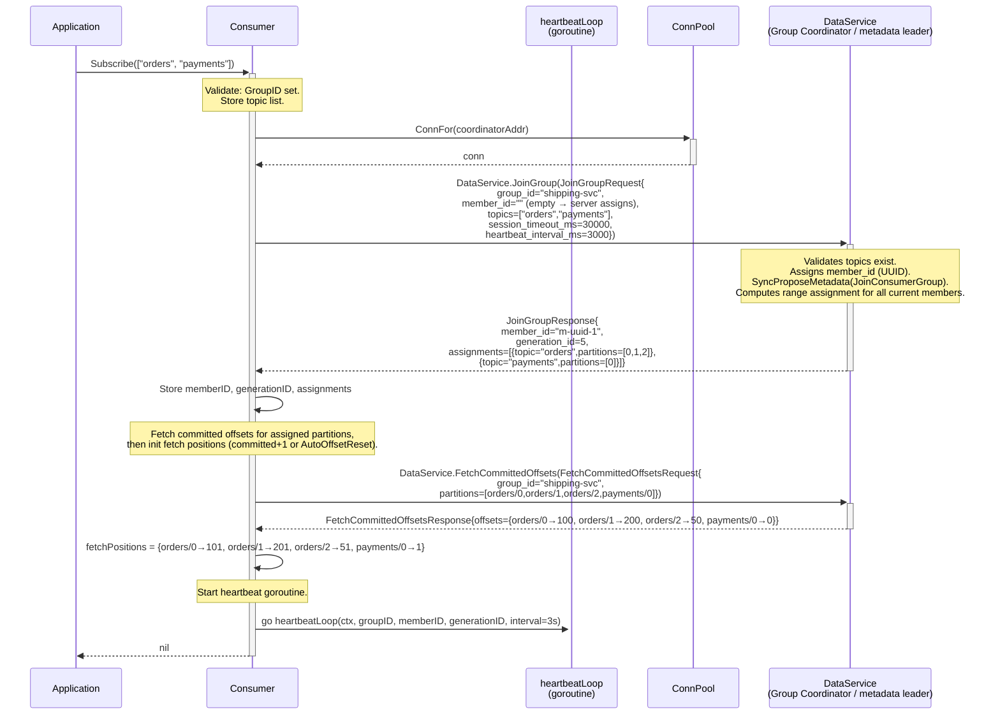
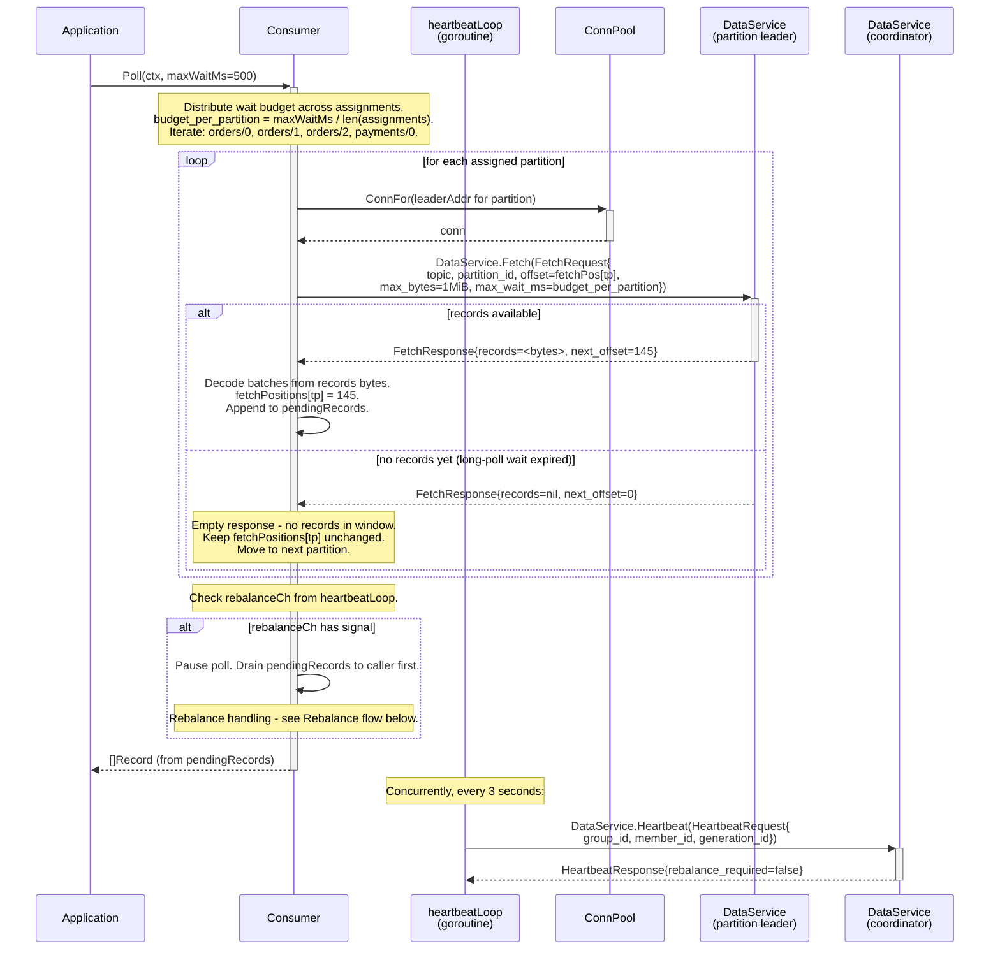
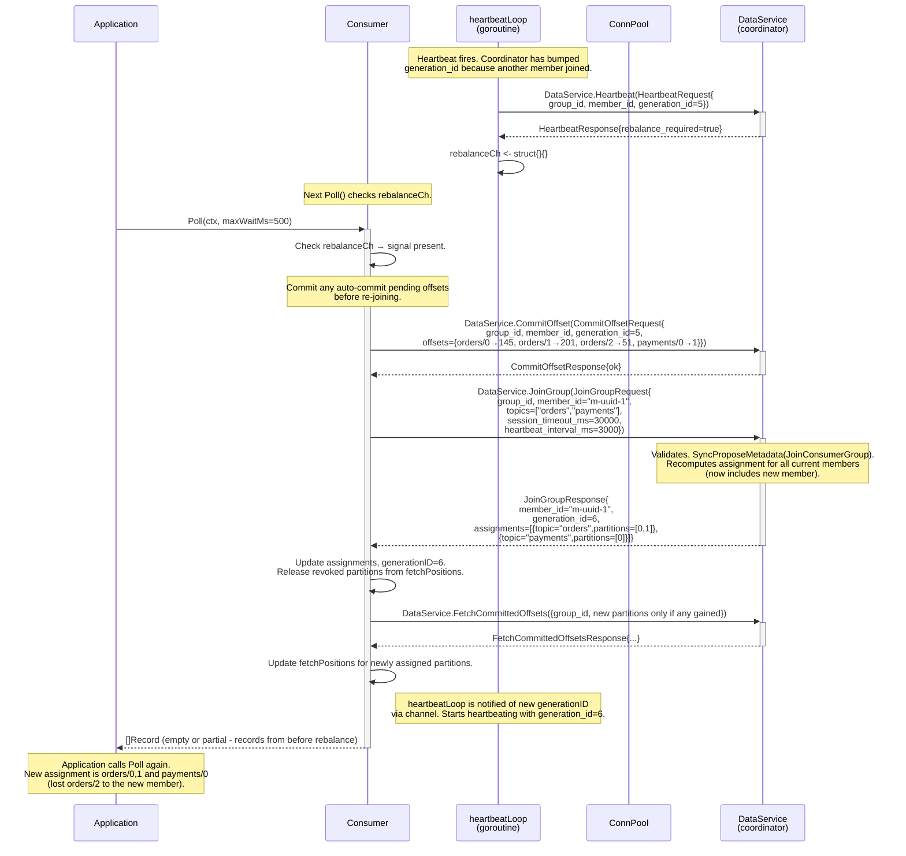
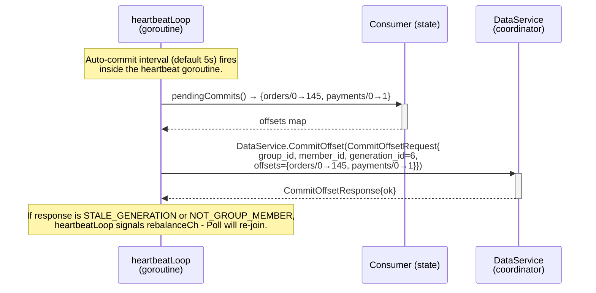

# Sequence: Consumer Poll Loop (group consumer with background heartbeat)

Full `Consumer.Poll` lifecycle for a group consumer from `Subscribe` through steady-state polling and a rebalance event. Shows the background heartbeat goroutine running concurrently with the poll loop.

## Subscribe + JoinGroup



---

## Steady-state Poll loop



---

## Rebalance flow (member joined or left the group)



---

## Auto-commit (background, within heartbeatLoop)



---

## Consumer.Commit (explicit, from application)

```mermaid
sequenceDiagram
    participant App as Application
    participant C as Consumer
    participant GC as DataService<br/>(coordinator)

    App->>+C: Commit(ctx)
    C->>C: Snapshot fetchPositions → commit map<br/>(last returned position per partition)

    C->>+GC: DataService.CommitOffset(CommitOffsetRequest{<br/>group_id, member_id, generation_id, offsets})
    GC-->>-C: CommitOffsetResponse

    alt STALE_GENERATION or NOT_GROUP_MEMBER
        GC-->>C: error detail
        C-->>-App: ErrStaleGeneration / ErrNotGroupMember<br/>(caller should re-subscribe or check group status)
    else ok
        C-->>-App: nil
    end
```

---

## Notes

- **One goroutine per consumer.** The heartbeat goroutine is the only background goroutine. Poll runs in the caller's goroutine. Thread safety: `fetchPositions` and `assignments` are only written by the Poll goroutine (on rebalance or after Fetch); the heartbeat goroutine reads `generationID` and `memberID` via an internal protected getter.
- **`maxWaitMs` budget distribution.** Budget is divided equally across assigned partition count. If five partitions are assigned and `maxWaitMs=500`, each Fetch gets `max_wait_ms=100`. This is an approximation; the caller sets the wall-clock budget, and the consumer honors it on a best-effort basis.
- **Non-group consumer.** No JoinGroup or heartbeat goroutine is started. User calls `Seek(topic, partition, offset)` to set read positions and calls `Poll`. Offsets are kept only locally unless the user calls `CommitOffsets` explicitly with a group ID.
- **Leader-change during fetch.** If a Fetch returns `NOT_LEADER`, the consumer calls `SetLeader` on MetaCache (same as producer) and retries the Fetch for that partition before returning to the caller. This is handled within the per-partition fetch step, not visible to the application.
- **Session timeout.** If the application does not call Poll for longer than `session_timeout_ms`, heartbeats still fire (they are in a separate goroutine), keeping the session alive as long as the consumer object exists.
