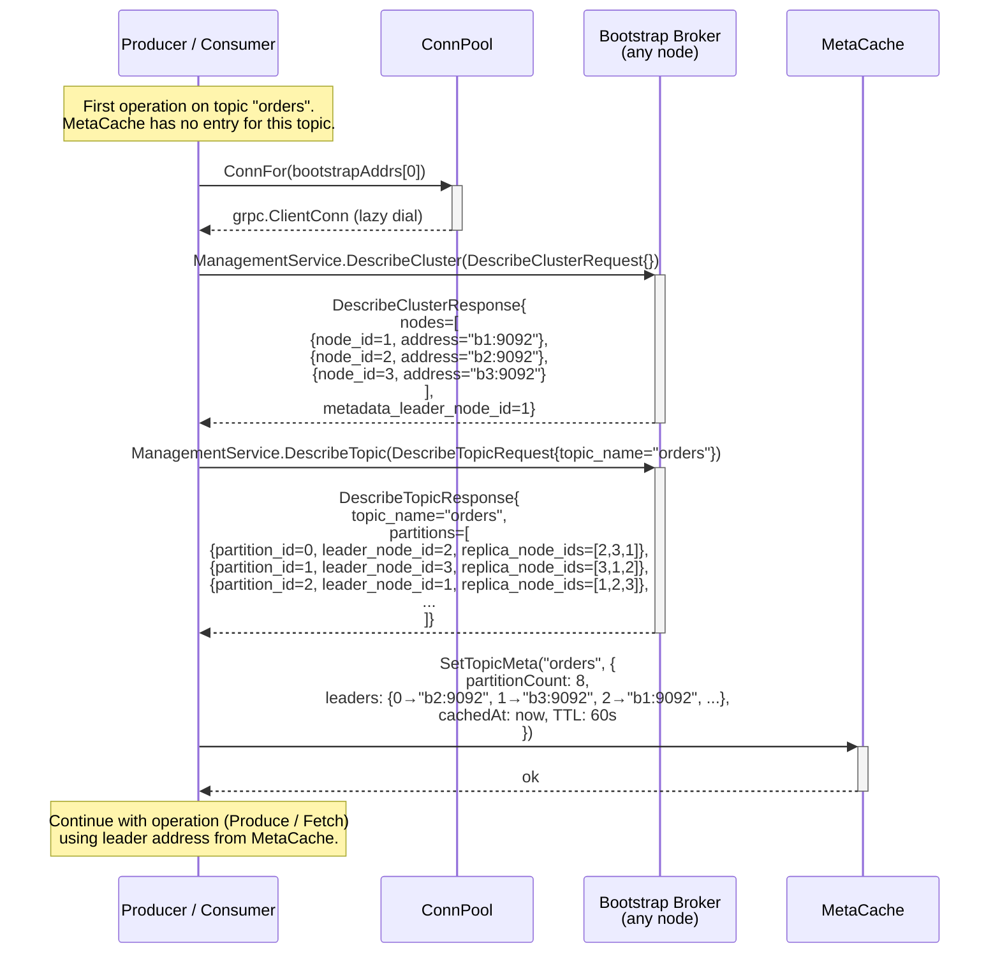
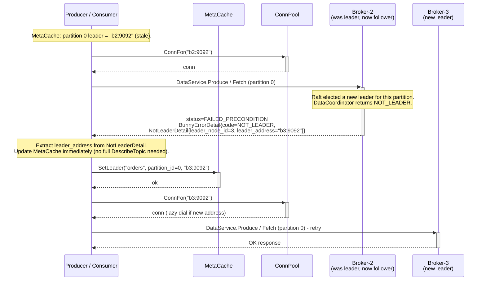
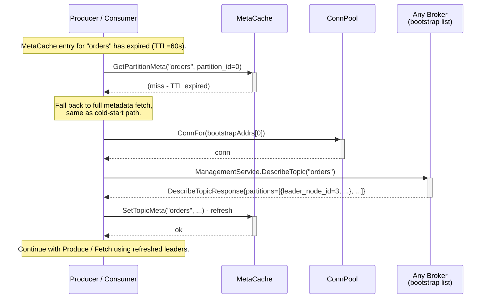
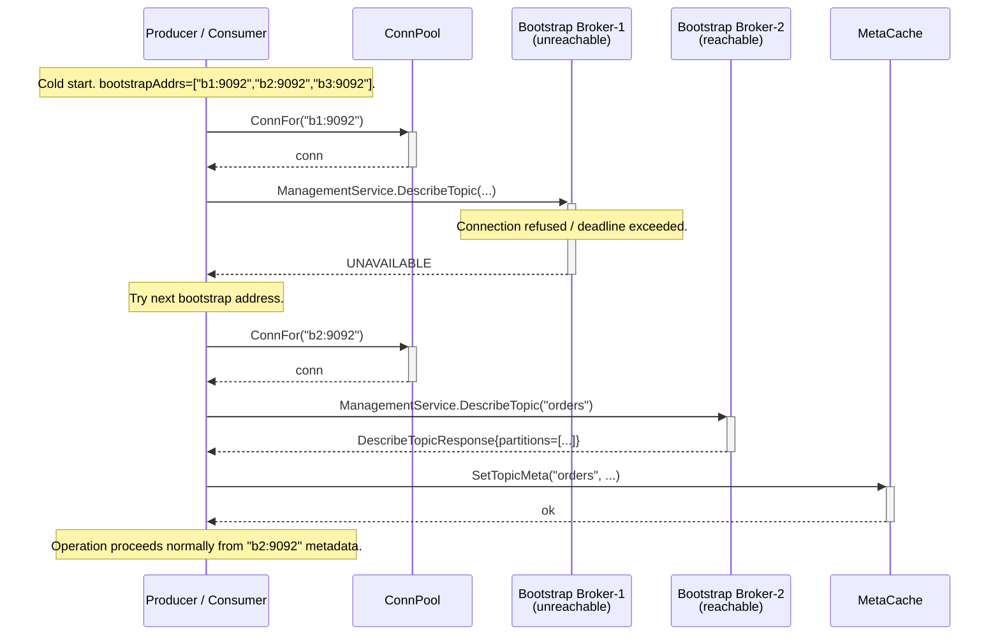

# Sequence: Client Leader Discovery

How the client library learns the current partition leader - at startup (cold cache) and after a leader change (stale cache). Applies to both Producer and Consumer. The AdminClient uses the same bootstrap mechanism but never touches the per-partition leader cache.

---

## Cold start: metadata fetch from bootstrap server



---

## Leader-change discovery via NOT_LEADER response



---

## TTL expiry: proactive metadata refresh



---

## Bootstrap failover: first broker unreachable



---

## MetaCache data structure

```go
type topicMeta struct {
    partitionCount int32
    leaders        map[int32]string // partition_id → "host:port"
    cachedAt       time.Time
}

type MetaCache struct {
    mu     sync.RWMutex
    topics map[string]*topicMeta // topic_name → meta
    ttl    time.Duration         // default 60s
}

// GetPartitionMeta returns ("", false) on miss (cold or TTL expired).
func (mc *MetaCache) GetPartitionMeta(topic string, partitionID int32) (leaderAddr string, ok bool)

// SetTopicMeta replaces the full topic entry and resets TTL.
func (mc *MetaCache) SetTopicMeta(topic string, partitionCount int32, leaders map[int32]string)

// SetLeader updates a single partition's leader without touching TTL or other partitions.
func (mc *MetaCache) SetLeader(topic string, partitionID int32, addr string)

// EvictTopic removes the topic entry entirely (called on TOPIC_NOT_FOUND after refresh).
func (mc *MetaCache) EvictTopic(topic string)
```

---

## Notes

- **No in-cluster forwarding.** The client always contacts the partition leader directly. There is no proxy or forward-to-leader within the broker cluster in v1.
- **SetLeader vs SetTopicMeta.** On a `NOT_LEADER` response the client calls `SetLeader` (single-partition point update using the address already in the error detail). A full `DescribeTopic` is only fetched on cold start or TTL expiry, to avoid a management RPC on every leader change.
- **Concurrent access.** `MetaCache` uses `sync.RWMutex`. `GetPartitionMeta` acquires `RLock`; `SetLeader` / `SetTopicMeta` / `EvictTopic` acquire `Lock`. Multiple goroutines (e.g. parallel per-partition sends) can safely read concurrently.
- **Bootstrap round-robin.** The client tries bootstrap addresses in order. A failed address is skipped for that attempt; all addresses are tried again on the next cold-start trigger (TTL expiry or first-use).
- **Coordinator discovery.** The Consumer uses the same `DescribeCluster` response to find `metadata_leader_node_id` and the corresponding address, which is used as the Group Coordinator address for `JoinGroup`, `Heartbeat`, `LeaveGroup`, `CommitOffset`, and `FetchCommittedOffsets`.
