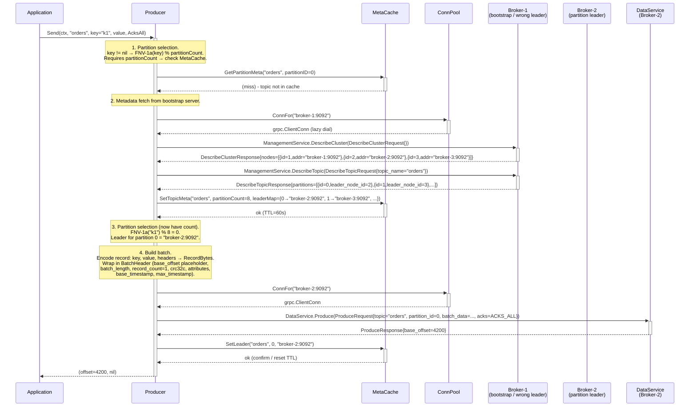
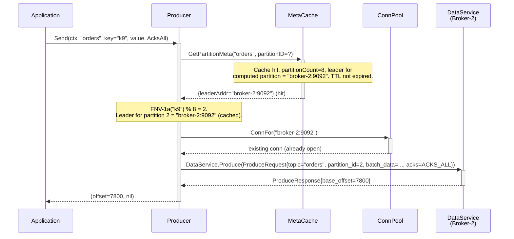
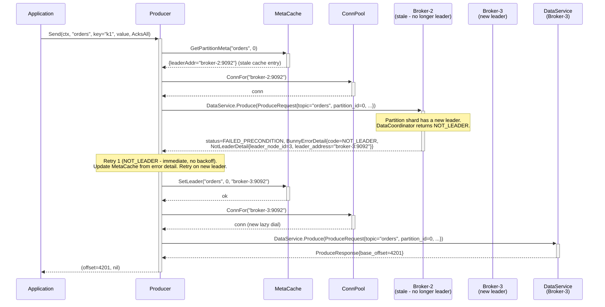

# Sequence: Producer Send - Full Path (cache miss, NotLeader retry)

Full `Producer.Send` flow including metadata cache population, leader resolution, and a NotLeader retry. The second call in a session to the same topic hits the warm cache and skips metadata fetch.

---

## Warm-cache path (second call, same topic/partition)

---

## NotLeader retry path

---

## Retry policy summary

| Error code | Retry? | Backoff | Max retries | Cache action |
|---|---|---|---|---|
| `NOT_LEADER` | Yes (immediate) | None - new leader address is in the error | `maxRetries` (default 3) | `SetLeader(topic, partition, leaderAddr)` from `NotLeaderDetail` |
| `UNAVAILABLE` | Yes | Exponential: 50ms → 100ms → 200ms → … cap 5s | `maxRetries` | None |
| `TIMEOUT` | Yes | Same as UNAVAILABLE | `maxRetries` | None |
| `INVALID_ARGUMENT` | No | - | - | None |
| `MESSAGE_TOO_LARGE` | No | - | - | None |
| `BATCH_TOO_LARGE` | No | - | - | None |
| `UNAUTHENTICATED` | No | - | - | None |
| `TOPIC_NOT_FOUND` | Refresh meta, then no | One metadata refresh, then surface to caller | 1 refresh | Full topic cache eviction |
| `INVALID_MESSAGE_FORMAT` | No | - | - | None |

## Notes

- **Metadata refresh on `TOPIC_NOT_FOUND`**: after cache eviction the producer re-fetches metadata once. If the topic still does not exist after refresh, the error is returned to the application.
- **acks=0 path**: identical routing and retry-on-NotLeader, but the Produce RPC returns `base_offset = -1` always. See [produce-acks-0.md](./produce-acks-0.md).
- **ConnPool dial**: `grpc.NewClient` is non-blocking. The TCP dial happens on the first RPC. Reconnects on transport failure are handled by gRPC's built-in retry backoff, below the producer retry loop.
- **Key=nil path**: round-robin counter (`atomic.Int64`) is used instead of FNV-1a hash. Counter is per-`Producer` instance, shared across all `Send` calls.
