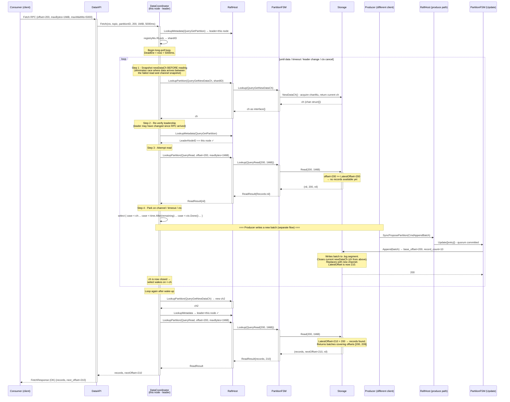
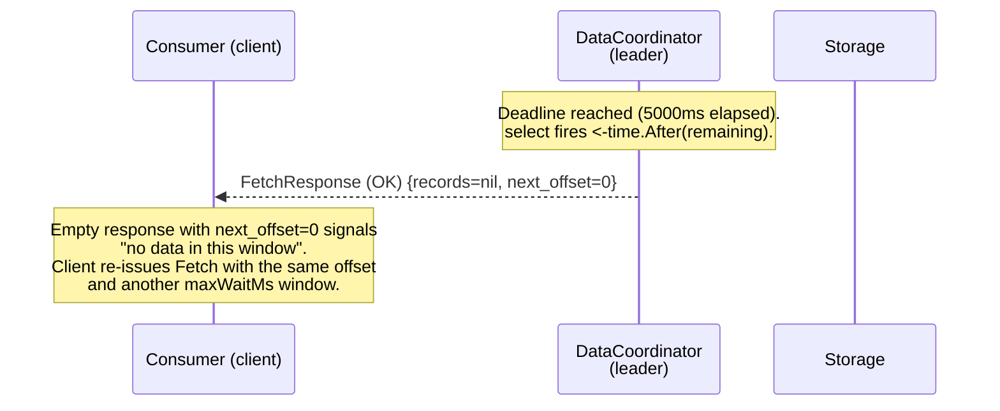
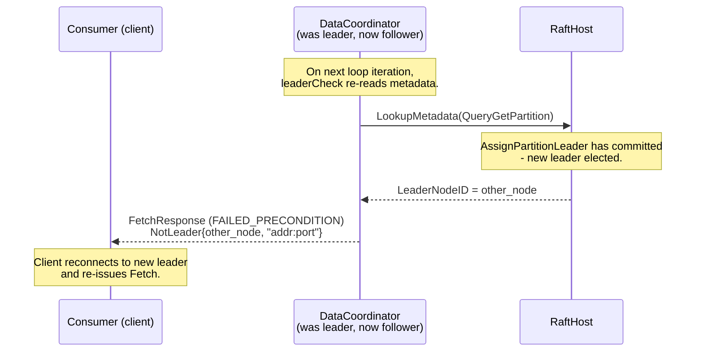

# Sequence: Consumer Fetch - Long-Poll (waiting for new records)

Fetch request where no records are available at the requested offset and `maxWaitMs > 0`. The goroutine parks until a producer writes new data, the timeout fires, the leader changes, or the client disconnects.



---

## Timeout path



---

## Leader-change path during long-poll



---

## Race elimination: why channel snapshot comes before Read

```text
Timeline (wrong order - channel snapshot AFTER read):

  t0: Read(200) → empty (LatestOffset=200)
  t1: [Producer] Append(batch) → LatestOffset=210, closes OLD_ch, creates NEW_ch
  t2: NewDataCh() → returns NEW_ch  ← wrong: we missed the notification
  t3: select on NEW_ch → blocks until NEXT append, missing offset 200..209

Timeline (correct order - channel snapshot BEFORE read):

  t0: NewDataCh() → returns OLD_ch
  t1: [Producer] Append(batch) → LatestOffset=210, closes OLD_ch, creates NEW_ch
  t2: Read(200) → may return empty (race) OR return data
      If empty: OLD_ch is already closed → select exits immediately → loop → Read again → finds data ✓
      If data:  return data directly ✓
```

This is the ordering invariant documented in [01-modules.md §5](../01-modules.md) and implemented in [05-data-coordinator.md §6.2](../05-data-coordinator.md).

---

## Notes

- **One goroutine per request.** Each long-poll Fetch occupies one gRPC handler goroutine for up to `maxWaitMs` ms. No goroutine pool is needed; gRPC's server handles the concurrency model.
- **Context cancellation.** If the consumer disconnects, the gRPC framework cancels `ctx`. The select's `<-ctx.Done()` arm exits the loop. No resource leaks.
- **`maxWaitMs` value selection.** The client library chooses `maxWaitMs = min(remaining_poll_timeout, server_max_wait)`. The server honours whatever value is sent (up to the request's gRPC deadline). See [07-client-library.md](../07-client-library.md).
- **Return value on timeout.** `FetchResponse` with `records=nil` and `next_offset=0` (or the original offset, depending on API Protocol decision in [06-api-protocol.md](../06-api-protocol.md)). The client re-uses its previous offset for the next poll. See Open Question 4 in [05-data-coordinator.md](../05-data-coordinator.md).
