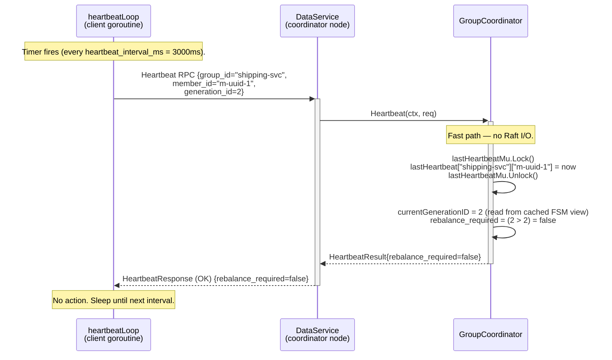
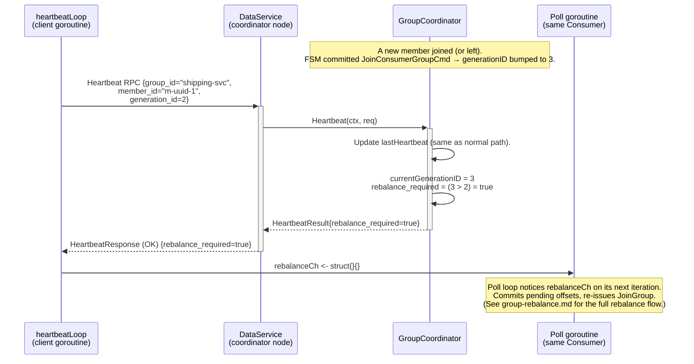
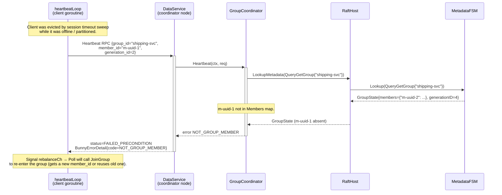
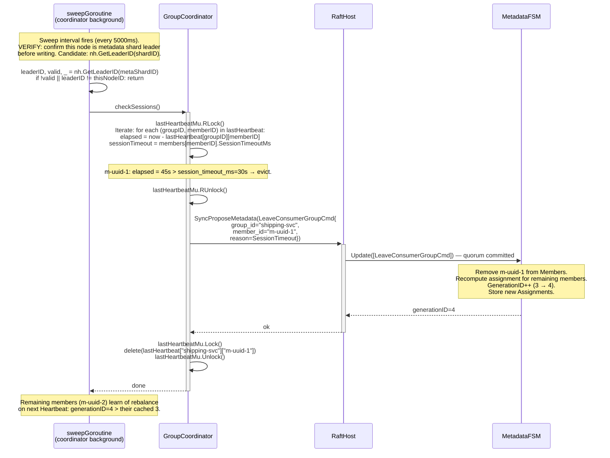

# Sequence: Consumer Group — Heartbeat

Heartbeat RPCs keep the member's session alive and deliver rebalance signals. In the normal (healthy) path there is no Raft round-trip — the coordinator responds from in-memory state. A Raft write occurs only when the session timeout sweep evicts a stale member.

---

## Normal heartbeat (no rebalance)

---

## Heartbeat with rebalance signal

---

## Heartbeat with unknown member_id (evicted or never joined)

---

## Session timeout sweep (server-side eviction)

---

## Notes

- **No Raft I/O on healthy heartbeat.** The coordinator reads `currentGenerationID` from a cached view of the FSM (updated whenever a metadata write commits). For v1 this cache is a field on the `GroupCoordinator` struct updated in the `SyncProposeMetadata` callback. VERIFY: dragonboat IStateMachine does not have an explicit update callback; the coordinator re-reads with a `LookupMetadata` only when the generation ID check would benefit from freshness. In practice the coordinator always has the current generation because it was the one who proposed the last membership change.
- **Heartbeat RPC does not include the committed offset.** Offset management is a separate concern (`CommitOffset` RPC). The heartbeat only signals liveness.
- **`generation_id` in heartbeat request.** The client sends its last-known `generation_id`. If `server_generation > client_generation`, `rebalance_required=true`. The server does not return the current generation in the heartbeat response — the client learns the new generation by re-issuing `JoinGroup`.
- **Concurrent sweep and heartbeat.** The sweep goroutine and heartbeat handlers both access `lastHeartbeat` — protected by `lastHeartbeatMu`. The sweep acquires `RLock` for iteration and upgrades to `Lock` only to delete an evicted entry (the upgrade is not atomic; the sweep re-checks the elapsed time under `Lock` before deleting to avoid TOCTOU).
