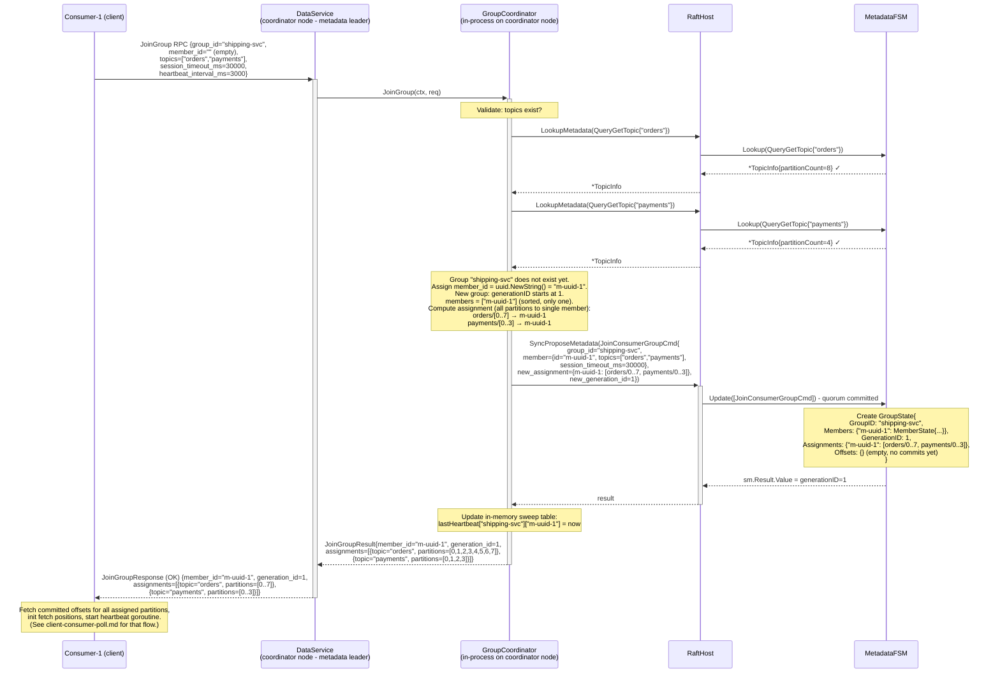
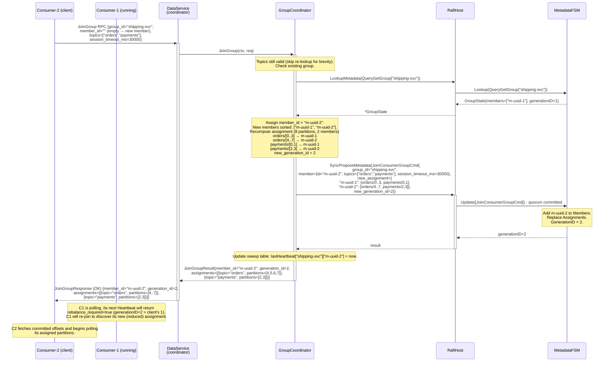
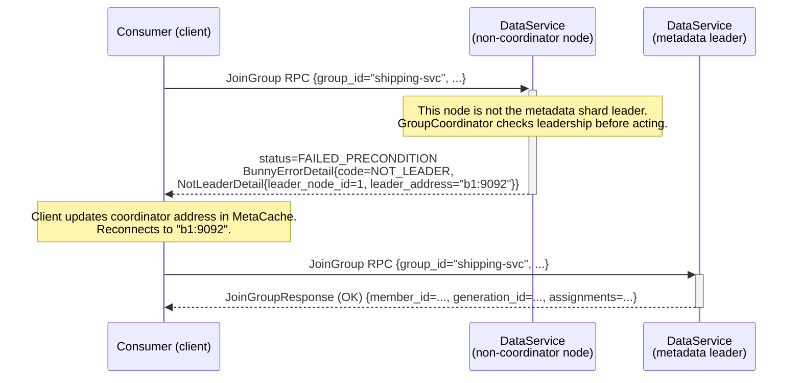

# Sequence: Consumer Group - JoinGroup

Full `JoinGroup` flow from the first member creating the group through a second member joining (triggering a rebalance). Both flows go through the metadata shard leader as the group coordinator.

---

## First member joins (group does not exist yet)

---

## Second member joins (rebalance)

---

## NotLeader path

---

## Notes

- **Concurrent JoinGroup calls.** If two consumers join simultaneously, their `SyncPropose` calls are serialised by dragonboat's propose pipeline. Each commit produces a new generation. The first committer produces generation N; the second committer computes its assignment based on the FSM state it read before proposing - which may now be stale. The implementation must re-read the group state after commit to build the response, not use the pre-propose snapshot.
- **Re-joining with existing member_id.** A client that already has a `member_id` (e.g. re-joining after a rebalance signal) sends it in the request. The coordinator treats this as an update to the existing member entry, reuses the same `member_id`, and recomputes the assignment. The `MemberState.JoinedAt` is not updated on re-join (it records the original join time).
- **Validation of session_timeout_ms bounds.** Server enforces `1000 ≤ session_timeout_ms ≤ 300000`. Values outside this range return `INVALID_ARGUMENT`.
