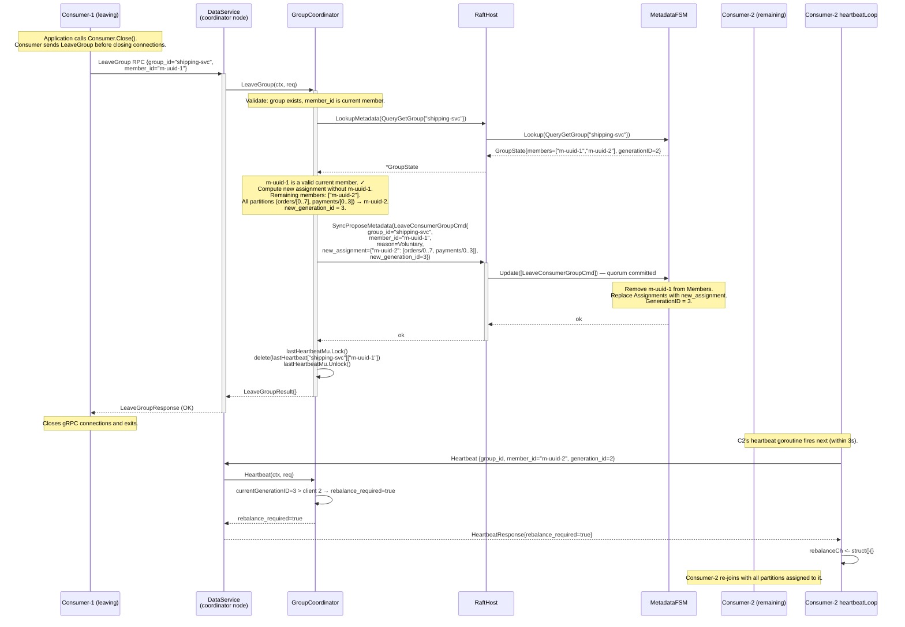
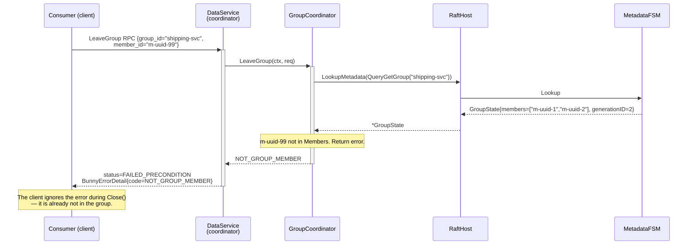
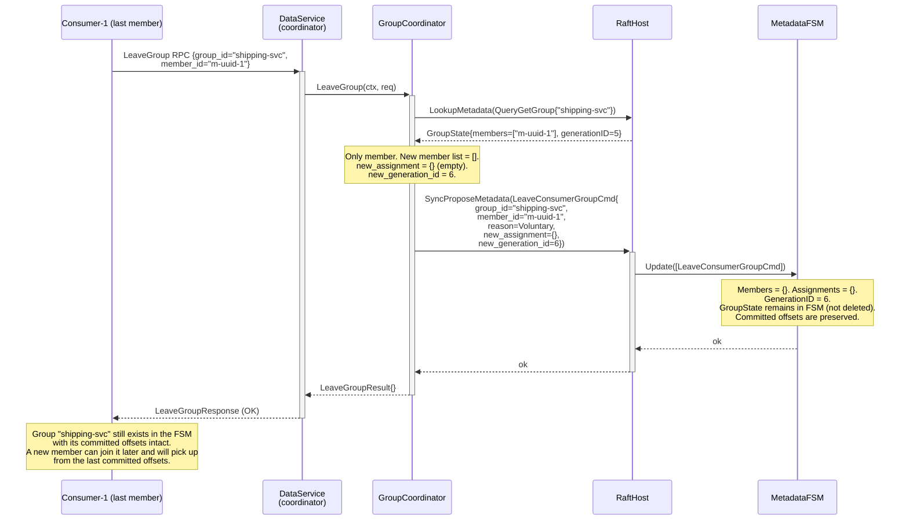

# Sequence: Consumer Group — LeaveGroup

Voluntary member departure. The coordinator removes the member, recomputes the assignment, and bumps the generation ID. Remaining members learn of the change on their next heartbeat.

---

## Voluntary leave

---

## LeaveGroup with unknown member_id

---

## Last member leaves (group becomes empty)

---

## Notes

- **Group is not deleted when the last member leaves.** The `GroupState` (with its committed offsets) remains in the FSM. This matches Kafka semantics: committed offsets survive until the group is explicitly deleted (not implemented in v1) or the FSM is wiped.
- **Assignment computed in coordinator, not FSM.** The `LeaveConsumerGroupCmd` carries the pre-computed `new_assignment` payload. The FSM applies it as-is; it does not re-run the assignment algorithm. This keeps the FSM `Update` method strictly deterministic (all inputs are in the command).
- **Consumer.Close() behaviour.** The client library calls `LeaveGroup` before closing connections. If the RPC fails (coordinator unreachable), the client still closes — the session timeout sweep will eventually evict the member. The application should handle this gracefully.
- **Concurrent leave + join.** If C1 leaves and C3 joins at the same time, both propose independently. The resulting generation depends on the Raft commit order. The final assignment is consistent because each committer uses the pre-propose group state to compute the assignment — the later committer must re-read FSM state after commit to produce the correct response. See the concurrent join note in [group-join.md](./group-join.md).
