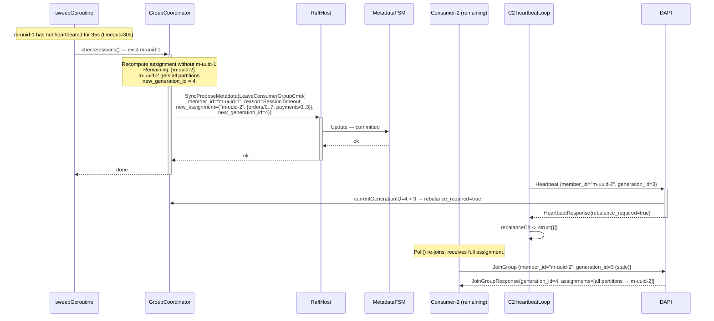
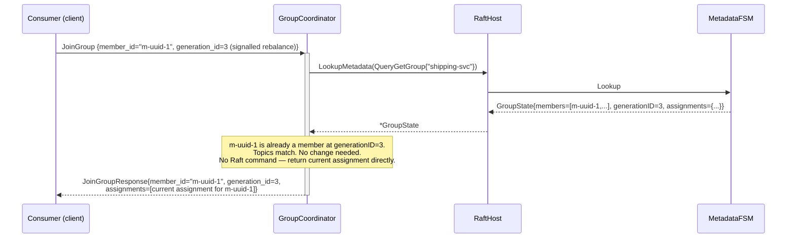

# Sequence: Consumer Group — Rebalance

A rebalance is triggered by any membership change (join or leave). There is no separate rebalance RPC; the coordinator signals existing members via the `Heartbeat` response and they re-join to receive their new assignment. This is a stop-the-world rebalance: all members pause, re-join, then resume.

---

## Rebalance triggered by new member joining (two existing members + one joining)

```mermaid
sequenceDiagram
    participant C3 as Consumer-3 (joining)
    participant C1 as Consumer-1 (existing)
    participant C2 as Consumer-2 (existing)
    participant HB1 as C1 heartbeatLoop
    participant HB2 as C2 heartbeatLoop
    participant DAPI as DataService<br/>(coordinator)
    participant GC as GroupCoordinator
    participant RH as RaftHost
    participant MFSM as MetadataFSM

    Note over MFSM: Current state: generationID=2,<br/>members=[m-uuid-1, m-uuid-2],<br/>assignments: m-uuid-1→orders/[0..3]+payments/[0,1],<br/>              m-uuid-2→orders/[4..7]+payments/[2,3]

    C3->>+DAPI: JoinGroup {group_id="shipping-svc", member_id="", topics=[...]}
    DAPI->>+GC: JoinGroup(ctx, req)

    Note over GC: Assign member_id = "m-uuid-3".<br/>New sorted member list: [m-uuid-1, m-uuid-2, m-uuid-3].<br/>Recompute range assignment (8 partitions, 3 members):<br/>  m-uuid-1 → orders/[0..2], payments/[0,1]  (3 orders + 2 payments)<br/>  m-uuid-2 → orders/[3..5], payments/[2,3]  (3 orders + 2 payments)<br/>  m-uuid-3 → orders/[6,7]                  (2 orders, payments exhausted)<br/>new_generation_id = 3

    GC->>+RH: SyncProposeMetadata(JoinConsumerGroupCmd{<br/>member={id="m-uuid-3",...}, new_assignment={...}, new_generation_id=3})
    RH->>MFSM: Update — committed
    MFSM-->>RH: generationID=3
    RH-->>-GC: ok

    GC-->>-DAPI: JoinGroupResult{member_id="m-uuid-3", generation_id=3,<br/>assignments=[{topic="orders", partitions=[6,7]}]}
    DAPI-->>-C3: JoinGroupResponse (OK) — C3 now fetching orders/6,7

    Note over C1,C2: C1 and C2 are still polling with generationID=2.<br/>They learn of the rebalance on their next heartbeat.

    par C1 heartbeat fires
        HB1->>+DAPI: Heartbeat {member_id="m-uuid-1", generation_id=2}
        DAPI->>GC: currentGenerationID=3 > 2 → rebalance_required=true
        GC-->>DAPI: rebalance_required=true
        DAPI-->>-HB1: HeartbeatResponse{rebalance_required=true}
        HB1->>HB1: rebalanceCh <- struct{}{}
    and C2 heartbeat fires
        HB2->>+DAPI: Heartbeat {member_id="m-uuid-2", generation_id=2}
        DAPI->>GC: currentGenerationID=3 > 2 → rebalance_required=true
        GC-->>DAPI: rebalance_required=true
        DAPI-->>-HB2: HeartbeatResponse{rebalance_required=true}
        HB2->>HB2: rebalanceCh <- struct{}{}
    end

    Note over C1: Poll() sees rebalanceCh signal.<br/>Commits pending offsets, re-joins.

    C1->>+DAPI: CommitOffset {member_id="m-uuid-1", generation_id=2, offsets={orders/0→120,...}}
    DAPI-->>-C1: CommitOffsetResponse (OK)

    C1->>+DAPI: JoinGroup {group_id="shipping-svc", member_id="m-uuid-1", topics=[...]}
    DAPI->>+GC: JoinGroup(ctx, req)
    Note over GC: m-uuid-1 already in Members (re-join). No new member added.<br/>generation_id already=3. No membership change → GenerationID stays 3.<br/>Return existing assignment for m-uuid-1.
    GC-->>-DAPI: JoinGroupResult{member_id="m-uuid-1", generation_id=3,<br/>assignments=[{topic="orders", partitions=[0,1,2]},{topic="payments",partitions=[0,1]}]}
    DAPI-->>-C1: JoinGroupResponse (OK) — C1 resumes with reduced assignment

    Note over C2: Same re-join flow for C2 (omitted for brevity).<br/>C2 receives: orders/[3,4,5], payments/[2,3].

    Note over C1,C2,C3: All three consumers now polling with generationID=3.<br/>No partition overlap. All partitions covered.
```

---

## Rebalance triggered by session timeout (member evicted)



---

## Re-join with no-op (generation already current)

When a client re-joins and the FSM has not changed since the previous `JoinGroup` for that member (e.g., the client is re-joining in response to a rebalance signal but the rebalance already included it), the coordinator detects that the member is already in the FSM at the current generation and returns its current assignment without issuing a new Raft command.



---

## Notes

- **Stop-the-world semantics.** All members must re-join after a rebalance signal before any member resumes polling with the new assignment. In practice, members re-join within `heartbeat_interval_ms` of receiving the signal. Cooperative rebalance (members can continue fetching unrevoked partitions) is a post-v1 enhancement.
- **Assignment consistency.** The assignment stored in the FSM is authoritative. Every member that re-joins receives its slice of that stored assignment. There is no negotiation between members; the coordinator is the single source of truth.
- **Commit before re-join.** The client library commits pending auto-commit offsets before re-issuing `JoinGroup` (see [client-consumer-poll.md](./client-consumer-poll.md)). This minimises re-processing after reassignment.
- **Partition overlap during transition.** Between the moment a member receives `rebalance_required=true` and the moment it stops fetching, it may continue to receive records from partitions that will be reassigned. Those records are processed and their offsets committed under `generationID=old`. The new member (or the same member with the reduced assignment) will start from the committed offset, so records are processed at most once per committed offset boundary. Exact-once is not guaranteed across the transition window in v1.
- **No push notification to members.** The coordinator never proactively contacts members. The rebalance signal is always delivered via the next `Heartbeat` response. The maximum delay for a member to notice a rebalance is `heartbeat_interval_ms` (default 3s).
