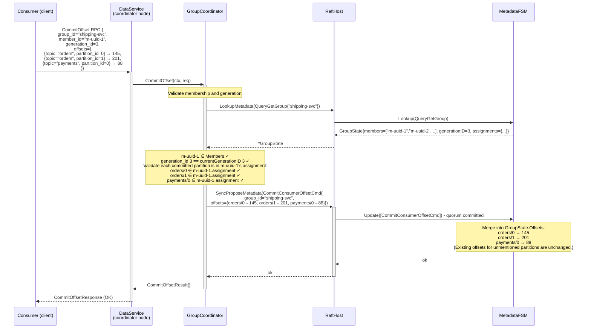
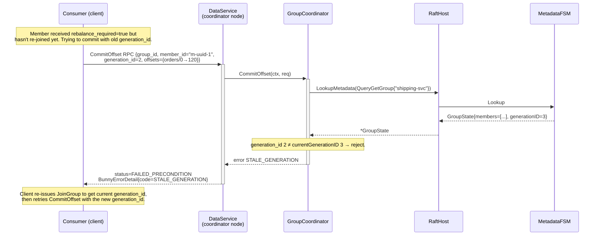
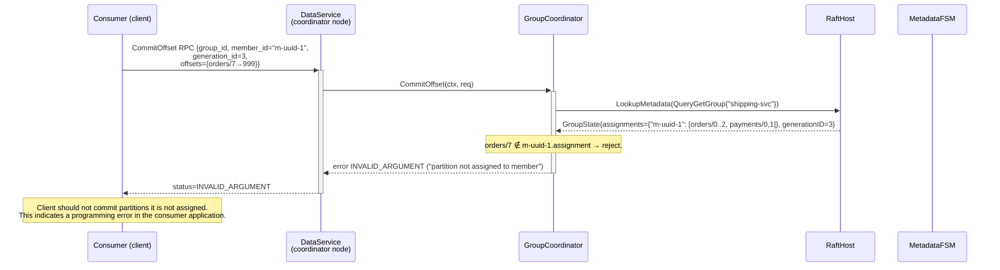
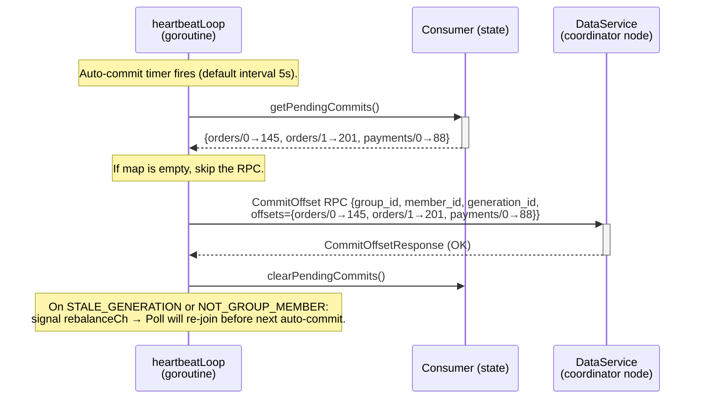

# Sequence: Offset Commit

Commits the consumer's read position for one or more `(topic, partition)` pairs to the Metadata FSM. The coordinator validates group membership and generation before accepting the commit.

---

## Successful offset commit (group consumer)

---

## Stale generation commit (member re-joined but using old generation_id)

---

## Commit for a partition not in the member's assignment

---

## Auto-commit (from heartbeat goroutine)

---

## Notes

- **Idempotency.** Committing the same offset twice is safe - the FSM stores the last committed value. Committing a lower offset than the current stored value is not rejected in v1 (the FSM just overwrites with the lower value). The client library never commits lower offsets (it only commits `fetchPosition - 1`, which is monotonically increasing). A future hardening could add server-side monotonicity enforcement.
- **Partial commits.** The `CommitConsumerOffsetCmd` commits all listed partitions atomically (single Raft command). Either all succeed or none do. The client can commit a subset of its assigned partitions in each call.
- **Committed offset semantics.** Offset `N` committed means "record N-1 was the last processed record; next fetch should start at N." The client library stores `fetchPosition` (which is already `nextOffset` from the last successful Fetch) and commits it directly. On re-join, the coordinator returns the committed value; the client starts fetching from `committed + 1` - actually from `committed` directly, since `committed` == next offset to read.

  Correction: the offset stored is the **next offset to fetch**, not the last processed record's offset. This matches the convention: `fetchPosition` = `nextOffset` from last Fetch response. Stored value = what to pass as `offset` in the next Fetch.
- **Coordinator failover during SyncPropose.** The commit may or may not have been applied. The client retries; applying the same offset twice is safe (see idempotency note above).
