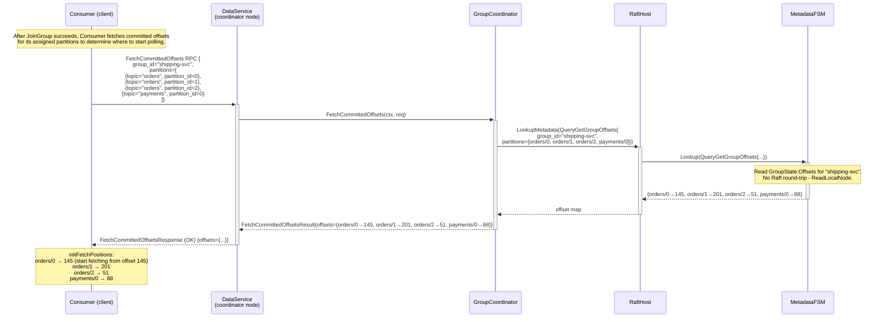
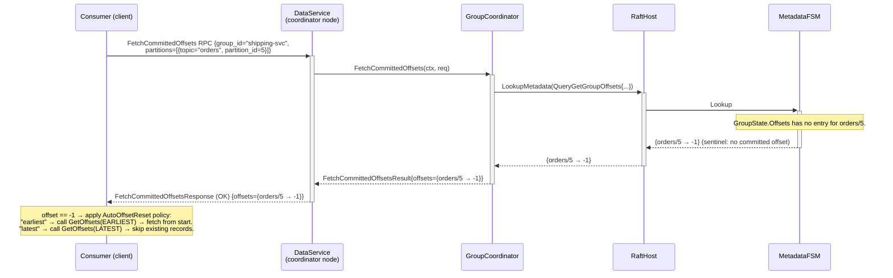
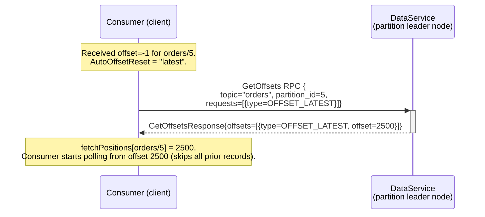
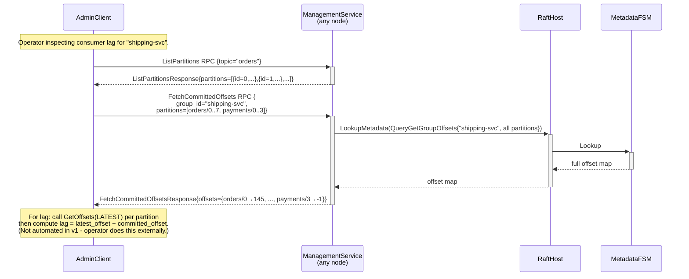

# Sequence: Offset Fetch

Retrieves committed offsets for a set of `(topic, partition)` pairs from the Metadata FSM. Read-only - no Raft round-trip.

---

## Successful offset fetch (group consumer at startup)

---

## Partition with no committed offset (first-time consumer)

---

## AutoOffsetReset resolution (consumer startup, no committed offset)

---

## AdminClient: inspect committed offsets for a group

---

## Notes

- **`FetchCommittedOffsets` is on the DataService.** Group-related RPCs (JoinGroup, Heartbeat, LeaveGroup, CommitOffset, FetchCommittedOffsets) are all on `DataService` (port `:9092`), not `ManagementService`. The coordinator is reached via the Data API port.
- **Non-group consumers.** A consumer without a `GroupID` does not call `FetchCommittedOffsets`. It maintains fetch positions locally (via `Seek`) or relies on `AutoOffsetReset` when starting fresh. Committed offsets for non-group consumers are not stored server-side in v1.
- **Partial request.** The client may request only the partitions it is currently assigned. It does not need to fetch offsets for the entire topic. The FSM lookup returns `-1` for any partition not present in `GroupState.Offsets`.
- **No Raft round-trip.** `QueryGetGroupOffsets` uses `LookupMetadata`, which calls dragonboat's `ReadLocalNode` path (no consensus needed). The read is served from the local FSM state snapshot. See [03-raft-fsm.md](./03-raft-fsm.md) for the `ReadLocalNode` / `Lookup` distinction.
- **Lag computation.** Computing consumer lag (`latestOffset − committedOffset`) requires calling `GetOffsets(LATEST)` on each partition leader separately, then subtracting the committed offset. This is a two-step operation in v1 that the client or operator must perform. A dedicated `DescribeConsumerGroupLag` API is post-v1.
