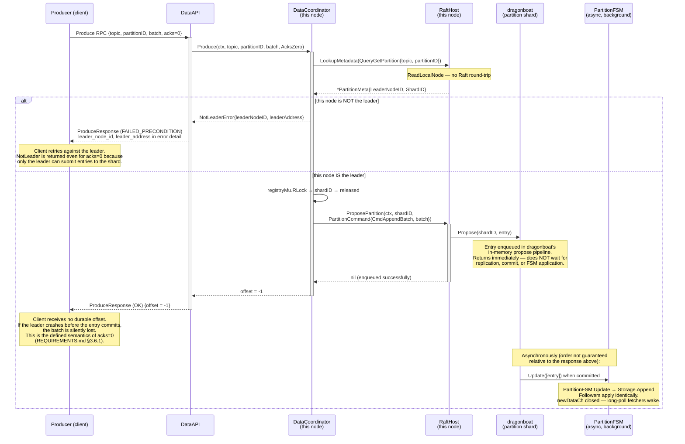

# Sequence: Produce (acks=0)

Fire-and-forget produce. The Data Coordinator enqueues the entry in dragonboat's propose pipeline and returns immediately — without waiting for replication, quorum commit, or FSM application. No offset is returned to the client.

## Comparison: acks=all vs acks=0

| Property | acks=all | acks=0 |
|---|---|---|
| Returns after | Quorum commit + FSM apply | Propose enqueue |
| Offset returned | Yes, `base_offset` of the batch | No, `-1` |
| Durability | Guaranteed to quorum | Not guaranteed; lost on leader crash before commit |
| Latency | ~Raft RTT × election overhead (~2–5 ms LAN) | Near-zero (~1 µs enqueue) |
| NotLeader check | Yes — only leader can propose | Yes — same: only leader can propose |
| dragonboat call | `SyncPropose` | `Propose` |

## Notes

- **LeaderCheck still required.** Even for acks=0, only the partition shard leader can accept proposals. A follower receiving a Propose call via `ProposePartition` would have dragonboat forward it to the leader internally — but this internal forwarding behaviour in dragonboat is VERIFY (not relied upon in v1). Instead, the Data Coordinator performs a leader check and returns `NotLeader` if it is not the leader, consistent with the acks=all path.

- **No offset.** REQUIREMENTS.md §3.6.1 explicitly states "No offset returned" for acks=0. The `-1` sentinel is the convention; the client library documents that `Send(..., AcksZero)` always returns `offset = -1`.

- **Pipeline full / NodeHost closing.** If dragonboat's propose pipeline is full or the NodeHost is shutting down, `Propose` returns an error. The Data Coordinator maps this to `Unavailable`. This is rare under normal operation. VERIFY the exact dragonboat v4 error type for this condition (Open Question 5 in [05-data-coordinator.md](../05-data-coordinator.md)).
