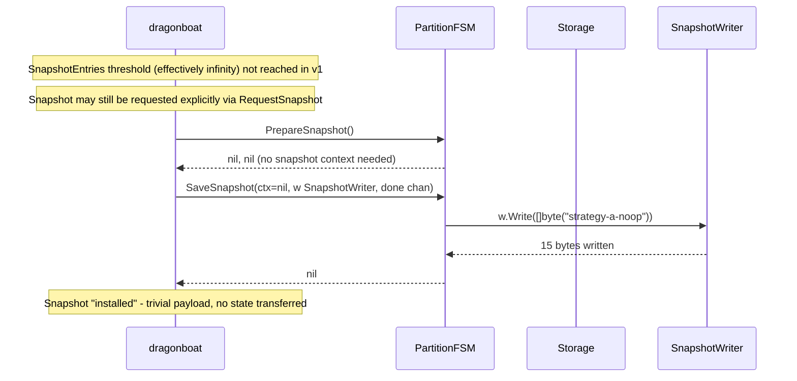
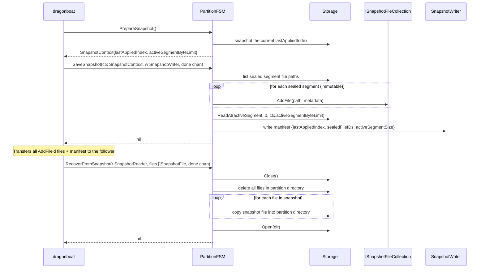

# raft-snapshot-partition: Partition FSM Snapshot Strategy

The Partition FSM implements Strategy A (no-op snapshots) for v1. When dragonboat requests a snapshot, the FSM writes a trivial marker byte and returns. Recovery from a snapshot is also a no-op - the marker is consumed and discarded. With Strategy A, dragonboat's Raft log for each partition shard is never compacted (or compacted very lazily), meaning a fresh replica must replay the entire Raft log to catch up. This is acceptable for the course-project scope. Strategy B (segment manifest snapshot) is documented as an appendix and is the production path.



## Strategy A: Recovery from Snapshot

```mermaid
sequenceDiagram
    participant DB as dragonboat
    participant FSM as PartitionFSM
    participant SR as SnapshotReader

    Note over DB: Installing snapshot on a lagging follower (should be rare in v1)

    DB->>FSM: RecoverFromSnapshot(r SnapshotReader, done chan)
    FSM->>SR: io.Copy(io.Discard, r)
    Note over FSM: Marker consumed; no state change
    FSM-->>DB: nil

    Note over DB: Resumes sending Raft log entries from snapshot index + 1
    Note over FSM: Must replay ALL entries from index 0 to catch up (Strategy A limitation)
```

## Participants

| Participant | Role |
|-------------|------|
| `dragonboat` | Manages snapshot lifecycle; calls PrepareSnapshot, SaveSnapshot, RecoverFromSnapshot. |
| `PartitionFSM` | Strategy A: writes/reads a trivial marker; does not interact with Storage. |
| `Storage` | Not involved in Strategy A snapshots. |
| `SnapshotWriter / SnapshotReader` | dragonboat-managed I/O streams; carry the snapshot bytes between nodes. |

## Strategy A Trade-offs

| Aspect | Strategy A (v1) |
|--------|----------------|
| Implementation complexity | Trivial |
| Raft log size | Ever-growing (never compacted) |
| Fresh replica bootstrap | Replay entire Raft log from index 0 |
| Data durability | Unaffected - Storage log is independent |
| Storage retention | Segments deleted by retention even if Raft log still references them - if a replica replays a deleted entry, `Storage.Append` re-writes it from the Raft log payload |

---

## Appendix: Strategy B (Production Path)

Strategy B transfers the Storage segment files directly as the snapshot payload, eliminating the need to replay the Raft log. It is **not implemented in v1** but is documented here so that the architecture supports it.



**Strategy B guarantees:** After `RecoverFromSnapshot` returns, the follower's Storage is at exactly `lastAppliedIndex`. dragonboat resumes sending Raft log entries from `lastAppliedIndex + 1`. The Raft log need only retain entries after the latest snapshot index, enabling log compaction.

**Strategy B complexity:** The active segment must be truncated to `activeSegmentByteLimit` bytes (the byte boundary corresponding to `lastAppliedIndex`). Sealed segments are immutable and can be transferred as-is. File transfer uses dragonboat's `ISnapshotFileCollection` mechanism, which handles chunked streaming between nodes.
