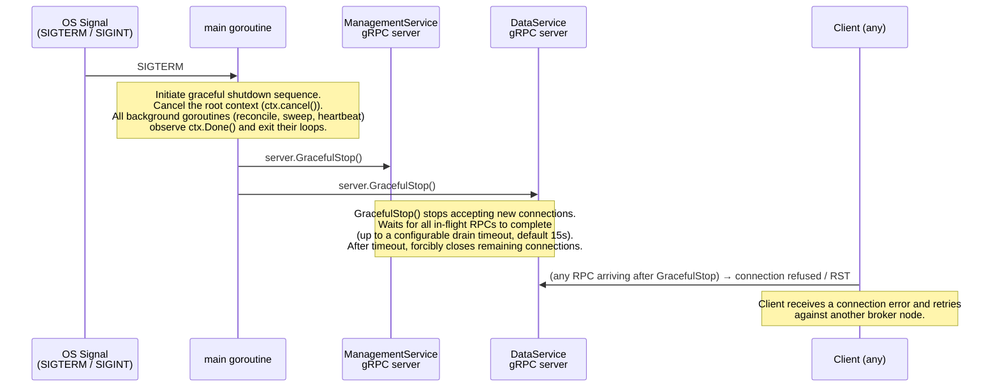
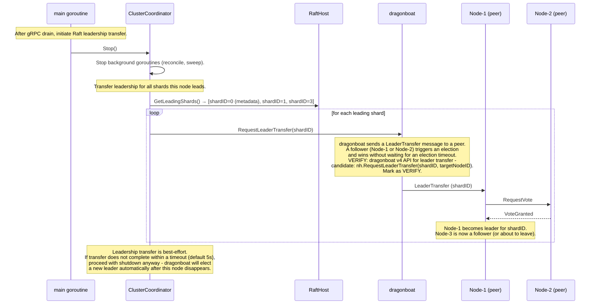
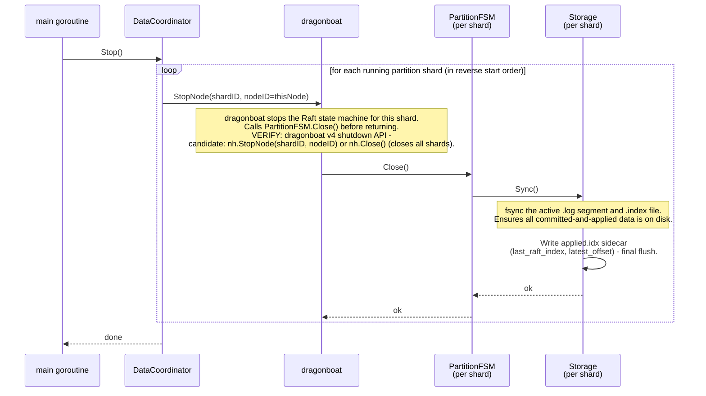

# Sequence: Graceful Single-Node Shutdown

Planned shutdown of one node. The goal is to stop accepting new RPCs, drain in-flight requests, transfer Raft leadership away from any shards this node leads (to minimise client disruption), and flush Storage before exiting.

---

## Phase 1 - Stop accepting new RPCs



---

## Phase 2 - Transfer Raft leadership



---

## Phase 3 - Stop partition shards and flush Storage



---

## Phase 4 - Stop metadata shard and exit

```mermaid
sequenceDiagram
    participant Main as main goroutine
    participant CC as ClusterCoordinator
    participant DB as dragonboat
    participant MFSM as MetadataFSM

    Main->>CC: StopMetadataShard()
    CC->>DB: StopNode(shardID=0, nodeID=thisNode)
    Note over DB: dragonboat stops metadata shard replica.<br/>Calls MetadataFSM.Close() if defined.<br/>In-memory state is discarded (recovered from snapshot on restart).
    DB->>MFSM: Close() (no-op - state is in-memory; snapshot already persisted by dragonboat)
    DB-->>CC: ok
    CC-->>Main: done

    Main->>DB: NodeHost.Close()
    Note over DB: Closes the dragonboat NodeHost entirely.<br/>Flushes any pending Raft log entries to disk.<br/>Releases all file handles and goroutines.
    DB-->>Main: ok

    Main->>Main: os.Exit(0)
```

---

## Shutdown sequence summary

```
SIGTERM received
  │
  ├─ 1. Cancel root context
  │      → background goroutines exit (reconcile, sweep, heartbeat)
  ├─ 2. gRPC GracefulStop() on both servers
  │      → drain in-flight RPCs (timeout 15s)
  ├─ 3. RequestLeaderTransfer for each leading shard (timeout 5s per shard)
  │      → minimise client disruption during election
  ├─ 4. DataCoordinator.Stop()
  │      → StopNode per partition shard
  │      → PartitionFSM.Close() → Storage.Sync() + applied.idx flush
  ├─ 5. ClusterCoordinator.Stop()
  │      → StopNode for metadata shard
  ├─ 6. NodeHost.Close()
  │      → flush Raft log, release resources
  └─ 7. os.Exit(0)
```

Total expected shutdown time on a lightly loaded node: under 5 seconds. Under heavy load (many in-flight RPCs), the gRPC drain timeout dominates.

---

## Failure scenarios during shutdown

| Scenario | Behaviour |
|---|---|
| gRPC drain timeout exceeded (in-flight RPCs still active) | `server.Stop()` forcibly closes remaining connections. Clients receive transport errors and retry. |
| Leader transfer fails or times out | Shutdown proceeds without transfer. dragonboat on remaining nodes detects the election timeout and elects a new leader within `electionRTT` × `electionTimeoutMultiplier` ticks (configurable). Typical: ~150–300ms on LAN. |
| Storage.Sync() fails (I/O error) | Logged as fatal. Shutdown continues - the node is already exiting. On restart, the applied.idx sidecar may be stale; dragonboat replays any missed log entries from the leader. |
| Process killed (SIGKILL, no graceful shutdown) | dragonboat Raft log is consistent (fsync'd per entry). Storage may have a partial last write; the `applied.idx` sidecar indicates the last clean boundary. On restart, entries after `last_raft_index` in the log are replayed. See [startup-node-join.md](./startup-node-join.md). |
| All three nodes shut down simultaneously | Cluster becomes unavailable. Clients receive `UNAVAILABLE`. When nodes restart, they reform the cluster via fresh `StartCluster(join=true)` calls and the metadata shard leader is re-elected. |

---

## Notes

- **No client forwarding during shutdown.** The node stops accepting new RPCs immediately via `GracefulStop`. Clients that hit a connection error retry against bootstrap addresses. The leader transfer (Phase 2) ensures the new leader is ready before the node goes dark, so retries typically succeed on the first attempt.
- **VERIFY: dragonboat leader transfer API.** `nh.RequestLeaderTransfer(shardID, targetNodeID)` - verify exact signature and whether a `targetNodeID` must be specified or if dragonboat picks a suitable follower automatically. If target is required, the coordinator must pick a follower from the shard's current membership.
- **VERIFY: dragonboat shutdown API.** `nh.StopNode(shardID, nodeID)` vs `nh.Close()`. `Close()` shuts down the entire NodeHost (all shards). Prefer `Close()` in the final step rather than per-shard `StopNode`, to avoid partial states. Verify call order with dragonboat v4 documentation.
- **MetadataFSM snapshot timing.** dragonboat automatically triggers snapshots based on the log compaction configuration (`CompactionOverhead`, `SnapshotIntervalScale`). The shutdown does not trigger an explicit snapshot - the last auto-snapshot is sufficient since Raft log replay covers any remaining entries.
- **Consumer group sessions during shutdown.** When this node was the group coordinator (metadata shard leader), members will receive heartbeat errors during the shutdown window. After the new metadata leader is elected, members' next heartbeats will hit `NOT_LEADER`, causing them to discover and reconnect to the new coordinator. Session timeouts are not triggered by this transient gap (the new coordinator resets heartbeat timers as described in [08-consumer-groups.md §9](../08-consumer-groups.md)).
