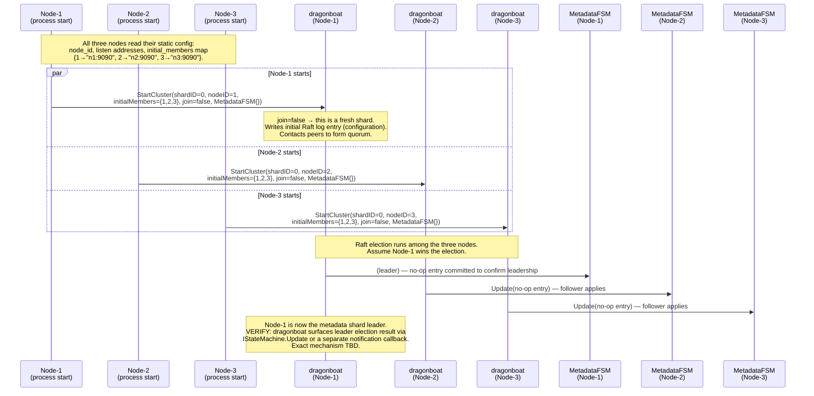
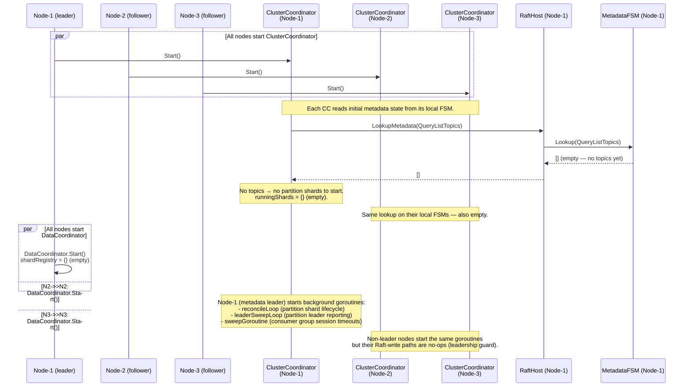
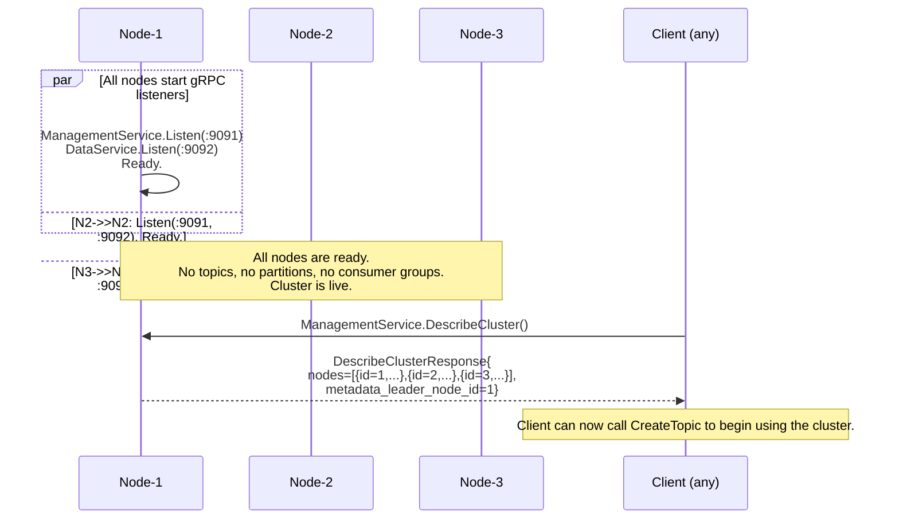

# Sequence: Fresh Cluster Bootstrap (3 nodes, no existing state)

Three nodes start simultaneously on a brand-new cluster. No metadata shard exists yet; nodes must form it from scratch, elect a leader, and signal readiness before accepting client traffic.

---

## Phase 1 — All three nodes start and form the metadata shard



---

## Phase 2 — Each node initialises its ClusterCoordinator



---

## Phase 3 — gRPC servers start, cluster signals ready



---

## Bootstrap readiness ordering

```
Node process start
  │
  ├─ 1. Load config (node_id, peers, data dir, token list)
  ├─ 2. Open / create dragonboat NodeHost
  ├─ 3. StartCluster(shardID=0, join=false) — metadata shard
  ├─ 4. Wait for metadata shard to have a leader
  │      (poll LookupMetadata or wait for first successful SyncPropose/Lookup)
  ├─ 5. ClusterCoordinator.Start() — reads initial FSM state
  ├─ 6. DataCoordinator.Start() — starts with empty shard registry
  ├─ 7. Start background goroutines (reconcile, sweep)
  └─ 8. Start gRPC listeners → signal ready
```

Step 4 blocks until quorum is established. If a node starts and cannot reach a quorum of peers within a configurable timeout (`startupTimeoutMs`, default 30s), it logs a fatal error and exits — this prevents a split-brain from forming with stale state.

---

## Notes

- **`join=false` vs `join=true`.** `join=false` tells dragonboat this is an initial cluster formation, not a node joining an existing cluster. All three nodes must use `join=false` on first boot. On subsequent restarts, nodes use `join=true` — see [startup-node-join.md](./startup-node-join.md).
- **No topic creation at bootstrap.** The cluster starts with zero topics. The first `CreateTopic` call from an admin client triggers partition shard creation across nodes. See [topic-create.md](./topic-create.md).
- **Static initial membership.** The `initialMembers` map is read from config and must be identical on all three nodes. Mis-matching configs produce split brains. Dynamic membership changes (add/remove nodes) are post-v1.
- **VERIFY: dragonboat leader notification.** The exact API by which a node learns it has become the metadata shard leader (to start write-eligible background goroutines) must be verified. Candidate: poll `nh.GetLeaderID(shardID)` on a short ticker after `StartCluster` returns. Alternatively, the first successful `SyncPropose` confirms leadership.
