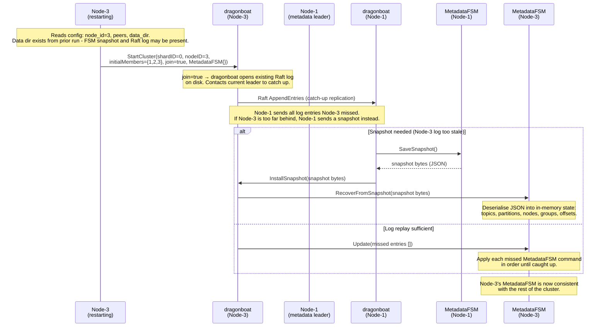
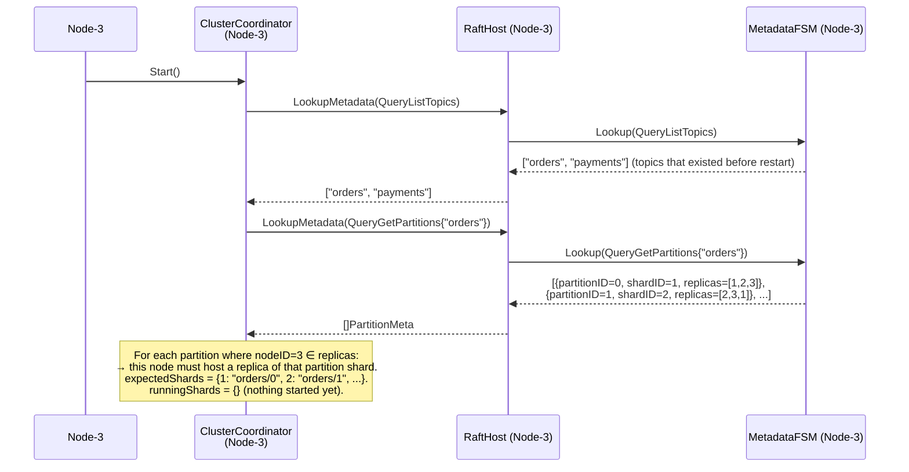
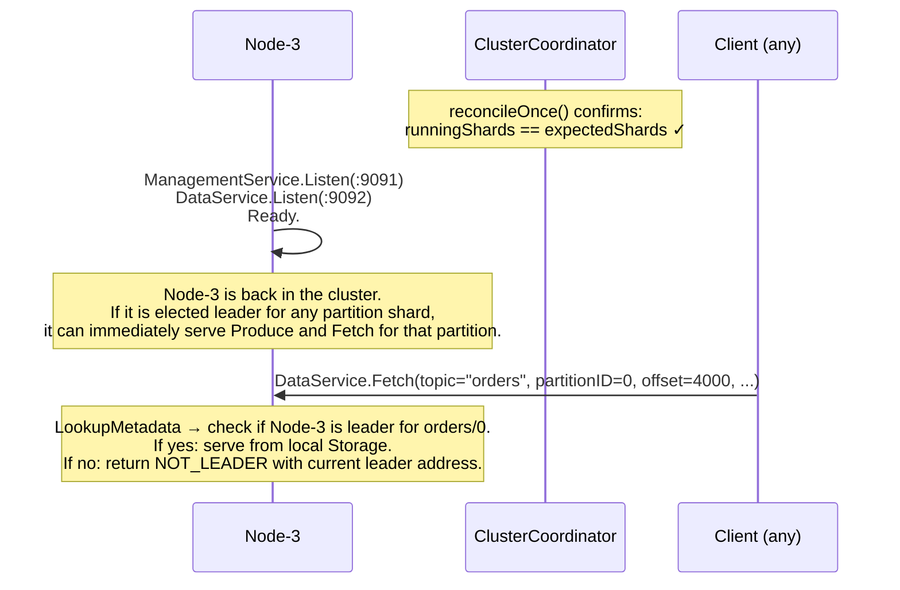

# Sequence: Node Restart / Join Existing Cluster

A previously-known node (Node-3) restarts after a crash or planned maintenance. The cluster has been running without it. Node-3 must rejoin the metadata shard, discover which partition shards it belongs to, and recover Storage state for each before accepting client traffic.

---

## Phase 1 - Rejoin metadata shard



---

## Phase 2 - ClusterCoordinator reads recovered state



---

## Phase 3 - DataCoordinator rejoins partition shards and recovers Storage

```mermaid
sequenceDiagram
    participant CC3 as ClusterCoordinator<br/>(Node-3)
    participant DC3 as DataCoordinator<br/>(Node-3)
    participant DB3 as dragonboat<br/>(Node-3)
    participant PFSM3 as PartitionFSM<br/>(Node-3, per shard)
    participant STR3 as Storage<br/>(Node-3, per shard)
    participant N1 as Node-1<br/>(partition shard leader)

    loop for each partition shard where Node-3 is a replica
        CC3->>DC3: StartPartitionReplica(topic="orders", partitionID=0)

        DC3->>DB3: StartOnDiskCluster(shardID=1, nodeID=3,<br/>initialMembers={1,2,3}, join=true,<br/>PartitionFSM{storagePath="data/orders/0"})

        Note over DB3: join=true → open existing Raft log for shard 1.<br/>PartitionFSM.Open() is called first.

        DB3->>PFSM3: Open(storagePath="data/orders/0")
        PFSM3->>STR3: Open("data/orders/0")
        Note over STR3: Scan segment files. Read applied.idx sidecar.<br/>applied.idx = {last_raft_index=420, latest_offset=4200}.<br/>Recover in-memory segment list and nextOffset.
        STR3-->>PFSM3: latestOffset=4200
        PFSM3-->>DB3: lastAppliedIndex=420

        Note over DB3: dragonboat knows node-3's log is at index 420.<br/>Contacts shard leader (Node-1) to catch up from 421.

        DB3->>N1: Raft catch-up request (from index 421)

        alt Snapshot needed (shard leader's log truncated before 421)
            N1->>PFSM3: SaveSnapshot() on leader's FSM
            Note over N1: PartitionFSM snapshot for IOnDiskStateMachine:<br/>Storage.Sync() + record the Storage file boundary<br/>(current nextOffset). Snapshot = {latestOffset, applied_idx_value}.
            N1->>DB3: InstallSnapshot(snapshot)
            DB3->>PFSM3: RecoverFromSnapshot(snapshot)
            PFSM3->>STR3: TruncateTo(snapshotLatestOffset)
            Note over STR3: Truncates any data beyond the snapshot boundary<br/>(should be none on a clean crash; guards against partial writes).
        else Log replay from 421 onward
            N1->>DB3: AppendEntries [421..current]
            DB3->>PFSM3: Update(entries)
            PFSM3->>STR3: Append(batch) per entry
            Note over STR3: Replays missed batches deterministically.<br/>Updates applied.idx sidecar after each apply.
        end

        DC3->>DC3: shardRegistry[shardID=1] = shard handle
        Note over DC3: Partition shard 1 is now registered and<br/>ready to serve Produce/Fetch for orders/0.
    end

    Note over N3: All assigned partition shards are running.<br/>Storage is consistent with the leader's state.
```

---

## Phase 4 - gRPC listeners start, node signals ready



---

## Startup ordering (node restart)

```
Node-3 process start
  │
  ├─ 1. Load config
  ├─ 2. Open dragonboat NodeHost (existing data dir)
  ├─ 3. StartCluster(shardID=0, join=true) - metadata shard catch-up
  ├─ 4. Wait for metadata shard catch-up complete
  │      (MetadataFSM consistent with cluster)
  ├─ 5. ClusterCoordinator.Start()
  │      ├─ Read topics + partitions from local MetadataFSM
  │      └─ Build expectedShards set
  ├─ 6. DataCoordinator.Start()
  │      └─ For each expected shard:
  │           StartOnDiskCluster(join=true)
  │           PartitionFSM.Open() → Storage.Open() → applied.idx recovery
  │           Raft catch-up (replay or snapshot)
  ├─ 7. Start background goroutines
  └─ 8. Start gRPC listeners → ready
```

Steps 3 and 6 block on dragonboat catch-up. The node does not accept client traffic until all shards it owns are caught up to within a configurable lag threshold. VERIFY: dragonboat does not expose a "caught up" notification directly; polling `GetLeaderID` or waiting for a successful `Lookup` after `StartOnDiskCluster` returns may be required.

---

## Notes

- **`join=true` vs `join=false`.** Only used on first boot is `join=false`. All subsequent starts (after any crash or restart) use `join=true`. The distinction matters to dragonboat: `join=false` creates a new shard, `join=true` resumes an existing one.
- **applied.idx recovery.** The `applied.idx` sidecar (16 bytes: `last_raft_index + latest_offset`) tells dragonboat's `IOnDiskStateMachine.Open` what the last durably applied index was. dragonboat uses this to determine how far back the Raft log catch-up must go. See [03-raft-fsm.md](./03-raft-fsm.md) and [02-storage.md](./02-storage.md).
- **Missed partition shard leadership.** While Node-3 was offline, the partition shards it was replicating may have elected new leaders among the remaining nodes (since RF=3, a quorum of 2 can proceed). On rejoin, Node-3 becomes a follower again for those shards. If the cluster decides Node-3 should be the leader (e.g. via dragonboat's election), it will be elected normally after catch-up.
- **Split-brain guard.** If Node-3 comes back with a stale Raft log index that differs from the cluster's committed log, dragonboat's catch-up mechanism handles it. No manual intervention is needed.
- **New node (never seen before).** Adding a completely new node (not a restart) is out of scope for v1 (static membership). If needed, dragonboat supports dynamic membership via `RequestAddNode` - deferred to post-v1.
