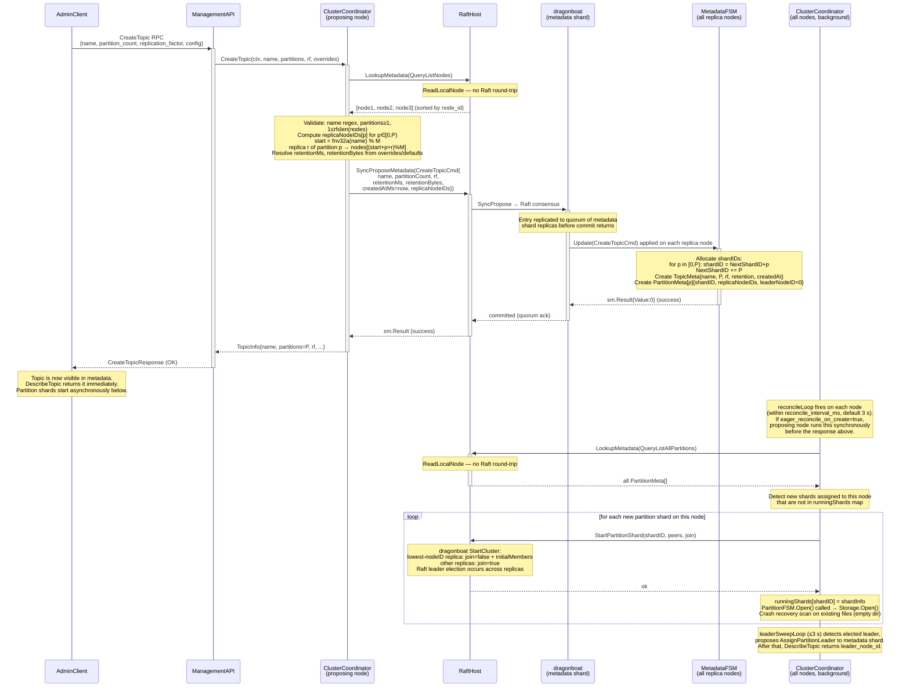

# Sequence: Topic Create

Full flow from gRPC entry on the receiving broker node to partition shards becoming available for produce/fetch on all replica nodes.

## Notes

- **Concurrency:** Multiple concurrent `CreateTopic` RPCs for the same topic are safe. Raft serialises them; one gets `sm.Result{Value:0}`, the rest receive `AlreadyExists` from the FSM.
- **Visibility window:** The topic appears in `ListTopics` / `DescribeTopic` as soon as the metadata command commits (before the gRPC response returns to the client). Partition shards may not yet be running; `LeaderNodeID` in `PartitionMeta` is initially `0` until the first `AssignPartitionLeader` commit.
- **Failure before partition shard start:** If the broker crashes after the metadata command commits but before partition shards start, the reconciliation goroutine starts them on the next boot (step 4 of bootstrap in [04-cluster-coordinator.md §8](../04-cluster-coordinator.md)).
