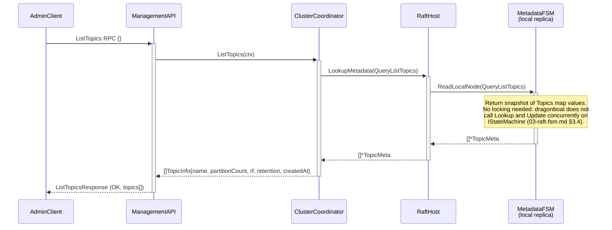
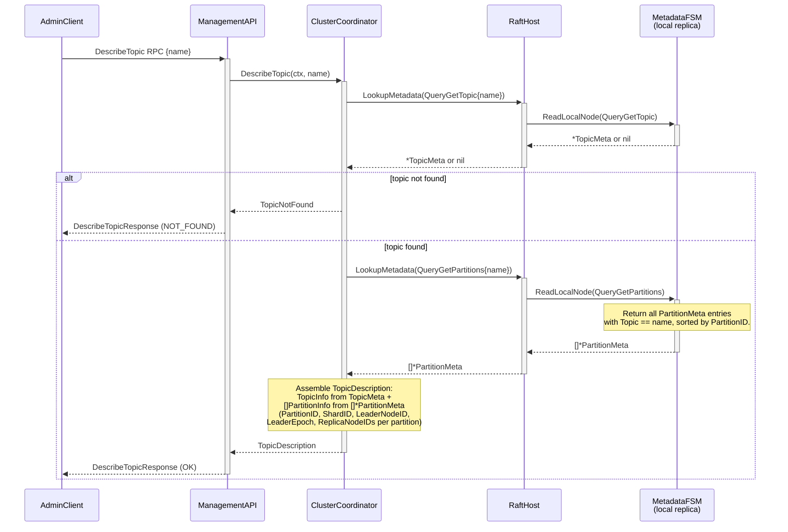

# Sequence: Topic List and Describe

Read-only admin operations. Both are served from the local Metadata FSM via `ReadLocalNode` - no Raft consensus round-trip. Any broker node can serve them regardless of whether it is the metadata shard leader.

---

## ListTopics

---

## DescribeTopic

---

## Notes

- **Staleness.** Both operations read from the local Metadata FSM replica. If this node is a follower and the leader has recently committed a metadata change (e.g. a new topic, a leader epoch update), there is a brief window during which this node's view is stale by up to one Raft RTT. This is acceptable: clients retry on `NotLeader` errors from the Data API, which embeds the current leader's address fetched from fresh metadata.
- **Concurrency.** Multiple concurrent `ListTopics` or `DescribeTopic` calls are served independently. `ReadLocalNode` on dragonboat's `IStateMachine` does not conflict with concurrent `Update` calls (dragonboat serialises them per [03-raft-fsm.md §3.4](../03-raft-fsm.md)).
- **DescribeCluster** follows the same pattern: `LookupMetadata(QueryListNodes)` returns `[]*NodeInfo`; the coordinator maps these to `ClusterDescription.Nodes`. Not shown separately because the flow is identical to `ListTopics`.
- **ListPartitions for a topic** (REQUIREMENTS.md §3.2.2) is a variant of `DescribeTopic` that additionally includes `current_offset_range` per partition. The `current_offset_range` is obtained from the Data Coordinator (which calls `LookupPartition(QueryEarliestOffset)` and `LookupPartition(QueryLatestOffset)` on each local partition shard). This cross-coordinator call is not shown here; it is detailed in [05-data-coordinator.md](../05-data-coordinator.md).
