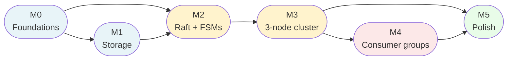

# BunnyMQ — Ticket Index

This document is the master index for the BunnyMQ implementation phase. It covers six milestones (M0–M5) and **68 tickets** (T-001–T-068) that take the project from an empty repository to a fully observable, docker-compose-deployable distributed message broker. Each milestone is a meaningful checkpoint at which the project can be paused or demoed.

---

## Milestones

| Milestone | Directory | Goal | DoD summary |
|-----------|-----------|------|-------------|
| [M0 — Foundations](./M0-foundations/) | `M0-foundations/` | Resolve design open questions; repo skeleton; build tooling | `go build ./...` passes; Makefile + lint + CI configured |
| [M1 — Storage standalone](./M1-storage-standalone/) | `M1-storage-standalone/` | Storage module fully tested in isolation | All Storage public methods work; unit + crash-recovery tests pass |
| [M2 — Raft + FSMs single node](./M2-raft-single-node/) | `M2-raft-single-node/` | dragonboat NodeHost + both FSMs on a single node | Topic create → append → fetch all going through Raft Apply → FSM → Storage |
| [M3 — 3-node cluster produce/fetch](./M3-cluster-produce-fetch/) | `M3-cluster-produce-fetch/` | Full end-to-end produce/fetch over 3-node cluster with leader failover | RF=3 topic, acks=all, leader kill → new leader → resume |
| [M4 — Consumer groups](./M4-consumer-groups/) | `M4-consumer-groups/` | Range-based consumer groups with rebalance and offset commit | JoinGroup, heartbeat, eviction, CommitOffset survive restart |
| [M5 — Integration and polish](./M5-integration-and-polish/) | `M5-integration-and-polish/` | Docker-compose cluster, Prometheus metrics, structured logging, full integration suite | `make integration-test` passes all scenarios |

---

## Inter-milestone dependency graph

**Critical path** (longest dependency chain): M0 → M1 → M2 → M3 → M4 → M5

Key critical-path tickets within milestones: T-012 (repo skeleton) → T-015 (batch encoder) → T-020 (Storage API) → T-024 (NodeHost) → T-039 (ClusterCoordinator) → T-047 (smoke test) → T-051 (GroupCoordinator) → T-065 (docker integration).

---

## Full ticket table

| ID | Title | Milestone | Effort | Deps |
|----|-------|-----------|--------|------|
| T-001 | VERIFY: dragonboat snapshot/entries API | M0 | XS | 0 |
| T-002 | VERIFY: dragonboat GetLeaderID API | M0 | XS | 0 |
| T-003 | VERIFY: StartCluster join vs bootstrap semantics | M0 | XS | 0 |
| T-004 | VERIFY: dragonboat IEventListener API | M0 | XS | 0 |
| T-005 | VERIFY: dragonboat Lookup/Update concurrency | M0 | XS | 0 |
| T-006 | VERIFY: dragonboat propose error codes | M0 | XS | 0 |
| T-007 | DECIDE: fsync strategy for Storage | M0 | XS | 0 |
| T-008 | DECIDE: retention enforcement strategy | M0 | XS | 0 |
| T-009 | DECIDE: offset-by-timestamp implementation | M0 | XS | 0 |
| T-010 | DECIDE: minor API decisions (cmd/bunnymq flags) | M0 | XS | 0 |
| T-011 | DECIDE: FSM additions (QueryGetNewDataCh, opcodes) | M0 | XS | 0 |
| T-012 | Repository skeleton (module layout, stub packages) | M0 | S | 1 |
| T-013 | Proto codegen pipeline (protoc, buf, Makefile target) | M0 | S | 1 |
| T-014 | Build tooling (Makefile, golangci-lint, CI script) | M0 | S | 1 |
| T-015 | Batch encoder + decoder + test vectors | M1 | S | 1 |
| T-016 | LogSegment: append, read, header parsing | M1 | M | 1 |
| T-017 | OffsetIndexSegment with mmap | M1 | S | 1 |
| T-018 | TimeIndexSegment with mmap | M1 | S | 1 |
| T-019 | SegmentStorage: roll and seal logic | M1 | M | 3 |
| T-020 | Storage public API and lifecycle | M1 | M | 1 |
| T-021 | Retention enforcement (time + bytes) | M1 | M | 1 |
| T-022 | Crash recovery (torn-write scan + truncate) | M1 | M | 1 |
| T-023 | Storage debug CLI (cmd/storage-debug) | M1 | S | 1 |
| T-024 | NodeHost wrapper and lifecycle | M2 | M | 2 |
| T-025 | MetadataFSM types and command set | M2 | S | 1 |
| T-026 | MetadataFSM Update — topic commands | M2 | M | 1 |
| T-027 | MetadataFSM Update — consumer group stubs | M2 | M | 2 |
| T-028 | MetadataFSM Lookup paths | M2 | M | 2 |
| T-029 | MetadataFSM snapshot save and restore | M2 | S | 2 |
| T-030 | PartitionFSM Open + Update (AppendBatch) | M2 | M | 2 |
| T-031 | PartitionFSM Lookup + snapshot strategy | M2 | M | 1 |
| T-032 | FSM determinism tests | M2 | M | 5 |
| T-033 | Single-node restart integration test | M2 | M | 3 |
| T-034 | Proto definitions for all 4 .proto files + codegen | M3 | S | 1 |
| T-035 | gRPC server bootstrap + auth + logging interceptors | M3 | S | 2 |
| T-036 | Management API gRPC server (8 RPCs) | M3 | M | 2 |
| T-037 | Data API gRPC — Produce + GetOffsets | M3 | M | 2 |
| T-038 | Data API gRPC — Fetch + long-poll | M3 | M | 2 |
| T-039 | ClusterCoordinator: bootstrap + topic lifecycle | M3 | M | 3 |
| T-040 | ClusterCoordinator: reconcile loop + leader sweep | M3 | M | 1 |
| T-041 | DataCoordinator: produce path + offset queries | M3 | M | 4 |
| T-042 | DataCoordinator: fetch + long-poll | M3 | M | 3 |
| T-043 | Client ConnPool, MetaCache, retry helpers | M3 | M | 2 |
| T-044 | Client Producer (Send, SendBatch, retry) | M3 | M | 3 |
| T-045 | Client AdminClient (8 management methods) | M3 | S | 2 |
| T-046 | Client Consumer — manual mode + BatchDecoder | M3 | M | 3 |
| T-047 | Multi-process 3-node cluster smoke test | M3 | M | 11 |
| T-048 | Leader-failover smoke test | M3 | M | 5 |
| T-049 | MetadataFSM — consumer group commands + queries | M4 | M | 2 |
| T-050 | Range-based partition assignment algorithm | M4 | S | 1 |
| T-051 | GroupCoordinator: JoinGroup + LeaveGroup | M4 | M | 3 |
| T-052 | GroupCoordinator: Heartbeat + session timeout sweep | M4 | M | 2 |
| T-053 | GroupCoordinator: CommitOffset + FetchCommittedOffsets | M4 | S | 2 |
| T-054 | Data API gRPC — consumer group handlers + wiring | M4 | M | 5 |
| T-055 | Client Consumer: group mode core (Subscribe, Commit) | M4 | M | 3 |
| T-056 | Client Consumer: background heartbeat + rebalance | M4 | M | 3 |
| T-057 | Group integration test — join, assignment, rebalance | M4 | M | 6 |
| T-058 | Group integration test — session timeout + offset persistence | M4 | M | 6 |
| T-059 | Dockerfile + docker-compose 3-node cluster | M5 | S | 1 |
| T-060 | Metrics: Storage metrics (12 metrics) | M5 | S | 2 |
| T-061 | Metrics: Raft + coordinator metrics (8 metrics) | M5 | S | 4 |
| T-062 | Metrics: API metrics + HTTP metrics/pprof servers | M5 | M | 3 |
| T-063 | Structured logging: zap construction + cross-module audit | M5 | M | many |
| T-064 | Integration test harness + Makefile targets | M5 | S | 2 |
| T-065 | Integration scenario: cluster bootstrap + produce/fetch | M5 | M | 6 |
| T-066 | Integration scenario: leader kill failover + cluster restart | M5 | M | 5 |
| T-067 | Integration scenario: consumer group rebalance + retention | M5 | M | 7 |
| T-068 | README.md | M5 | S | 2 |

**Total: 68 tickets** — M0: 14, M1: 9, M2: 10, M3: 15, M4: 10, M5: 10

**Effort breakdown:** 11 × XS, 18 × S, 39 × M — no L tickets.

**Estimated effort range:** XS≈30 min, S≈1.5 h, M≈3 h → 11×0.5 + 18×1.5 + 39×3 = 5.5 + 27 + 117 = **~150 person-hours** across all milestones.

---

## Recommended implementation order

Work through tickets in this sequence. Each ticket's dependencies are already satisfied by the time you reach it.

1. T-001 — VERIFY: dragonboat snapshot/entries API
2. T-002 — VERIFY: dragonboat GetLeaderID API
3. T-003 — VERIFY: StartCluster join vs bootstrap semantics
4. T-004 — VERIFY: dragonboat IEventListener API
5. T-005 — VERIFY: dragonboat Lookup/Update concurrency
6. T-006 — VERIFY: dragonboat propose error codes
7. T-007 — DECIDE: fsync strategy
8. T-008 — DECIDE: retention strategy
9. T-009 — DECIDE: offset-by-timestamp
10. T-010 — DECIDE: minor API decisions
11. T-011 — DECIDE: FSM additions
12. T-012 — Repository skeleton
13. T-013 — Proto codegen pipeline
14. T-014 — Build tooling
15. T-015 — Batch encoder/decoder
16. T-016 — LogSegment append/read
17. T-017 — OffsetIndexSegment
18. T-018 — TimeIndexSegment
19. T-019 — SegmentStorage roll/seal
20. T-020 — Storage public API
21. T-021 — Retention enforcement
22. T-022 — Crash recovery
23. T-023 — Storage debug CLI
24. T-024 — NodeHost wrapper
25. T-025 — MetadataFSM types
26. T-026 — MetadataFSM Update (topic)
27. T-027 — MetadataFSM Update (group stubs)
28. T-028 — MetadataFSM Lookup
29. T-029 — MetadataFSM snapshot
30. T-030 — PartitionFSM Open + Update
31. T-031 — PartitionFSM Lookup + snapshot
32. T-032 — FSM determinism tests
33. T-033 — Single-node restart test
34. T-034 — Proto definitions (all 4 files)
35. T-035 — gRPC server + auth interceptor
36. T-039 — ClusterCoordinator bootstrap + topic lifecycle
37. T-040 — ClusterCoordinator reconcile + leader sweep
38. T-041 — DataCoordinator produce + offsets
39. T-042 — DataCoordinator fetch + long-poll
40. T-036 — Management API gRPC server
41. T-037 — Data API: Produce + GetOffsets
42. T-038 — Data API: Fetch + long-poll
43. T-043 — Client ConnPool + MetaCache + retry
44. T-044 — Client Producer
45. T-045 — Client AdminClient
46. T-046 — Client Consumer (manual mode)
47. T-047 — Multi-process cluster smoke test
48. T-048 — Leader-failover smoke test
49. T-049 — MetadataFSM: group commands + queries
50. T-050 — Range partition assignment
51. T-051 — GroupCoordinator: JoinGroup + LeaveGroup
52. T-052 — GroupCoordinator: Heartbeat + sweep
53. T-053 — GroupCoordinator: CommitOffset + FetchOffsets
54. T-054 — Data API: consumer group handlers
55. T-055 — Client Consumer: group mode core
56. T-056 — Client Consumer: heartbeat + rebalance
57. T-057 — Group integration test: join + rebalance
58. T-058 — Group integration test: timeout + offsets
59. T-059 — Dockerfile + docker-compose
60. T-060 — Metrics: Storage
61. T-061 — Metrics: Raft + coordinator
62. T-062 — Metrics: API + HTTP servers
63. T-063 — Logging audit (cross-module)
64. T-064 — Integration test harness
65. T-065 — Integration: bootstrap + produce/fetch
66. T-066 — Integration: failover + restart
67. T-067 — Integration: group rebalance + retention
68. T-068 — README.md

---

## If running out of time

Milestones are ordered from "must ship" to "nice to have":

| Priority | Milestone | Skip cost |
|----------|-----------|-----------|
| **Must** | M0 + M1 + M2 + M3 | Cannot skip — these are the core product |
| **Should** | M4 — Consumer groups | Skip if single-consumer workloads are sufficient; multi-consumer use cases blocked |
| **Can skip** | M5 — Integration and polish | Skip for early development; docker, metrics, and logging polish can be added post-MVP |

**Minimum viable product:** M0 + M1 + M2 + M3 (T-001–T-048, ~48 tickets, ~100 person-hours). This delivers a functioning 3-node cluster that produces, replicates, and fetches records with leader failover.

**If skipping M4:** remove T-049–T-058. Note that T-027 (MetadataFSM group stubs) is still needed in M2 as it establishes the command framework even if group handlers are not wired up. Client Consumer group mode (T-055, T-056) is also skipped; manual-mode Consumer from T-046 remains available.

**If skipping M5:** remove T-059–T-068. The M3/M4 process-based integration tests (T-047, T-048, T-057, T-058) still run locally via `go test -tags integration`. Metrics and structured logging are absent but the cluster functions correctly.

---

## Unresolved VERIFY items

These design-phase open questions must be resolved at the start of implementation (M0 tickets T-001–T-006). They have been preserved as explicit VERIFY markers in the affected tickets:

| VERIFY item | Raised in | Affects |
|-------------|-----------|---------|
| dragonboat v4 `GetLeaderID(shardID)` signature and `valid=false` semantics during election | T-002 | T-040 (leader sweep), T-052 (session timeout sweep guard), T-054 (metadata leader check) |
| `StartCluster(join=false)` vs `join=true` semantics for multi-node bootstrap | T-003 | T-040 (startShard heuristic) |
| `IStateMachine.Lookup` thread-safety (can it be called concurrently with `Update`?) | T-005 | T-028, T-031 |
| Propose error codes returned on leader change (`ErrNotLeader` vs gRPC status) | T-006 | T-039, T-041 |
| Snapshot/entries: whether `IOnDiskStateMachine` receives `SaveSnapshot` during `Update` or in a separate goroutine | T-001 | T-031 |
